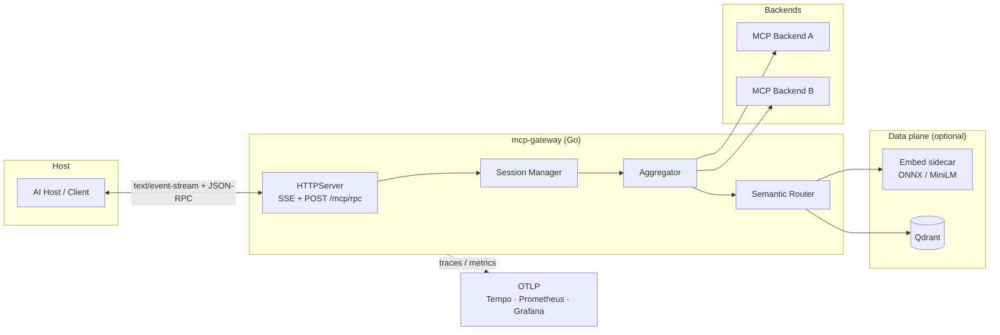

# MCP Gateway

Production-oriented **Model Context Protocol (MCP)** multiplexer and orchestrator in **Go**: one host-facing HTTP surface (SSE + JSON-RPC), many backends, optional **semantic routing** over **Qdrant**, and **OpenTelemetry**-first observability.

## Architecture



- **Ingress:** `GET /mcp/sse` opens the session; JSON-RPC **responses** (for requests with `id`) are pushed as SSE events. `POST /mcp/rpc` accepts one request per call (`202` when accepted).
- **Core:** `internal/gateway/aggregate` merges `initialize` and `tools/list`; `tools/call` is forwarded with stable namespacing (`prefix__tool`).
- **Router:** `internal/router` optionally rewrites ambiguous tool names using embeddings + vector search (see [ADR 0001](docs/adr/0001-architecture-decisions.md)).

## Why this stack

| Choice | Why |
|--------|-----|
| **Go** | Small static binary, excellent concurrency, fast JSON-RPC and HTTP, first-class context cancellation for timeouts and graceful shutdown—fits SRE-style services and thesis benchmarks. |
| **Qdrant** | Fast filtered ANN search over tool vectors; clear HTTP API and Docker story; supports catalog versioning and explainable candidates. |
| **ONNX / local embeddings** | Keeps routing signals on-prem, removes per-call embedding API cost and tail latency from the public internet, and simplifies air-gapped or CI runs (privacy + predictability). |

## Quick start (Makefile)

From the **repository root** (`tfm/`) or from **`mcp-gateway/`**:

```bash
cd mcp-gateway   # or stay at repo root: make runs `-C mcp-gateway`
make help
```

Typical flow:

```bash
make docker-up          # Qdrant, embed sidecar, OTel collector, Tempo, Prometheus, Grafana
make run                # gateway on PORT / GATEWAY_PORT (default 18080 with .env patterns)
make test               # vet + race + unit tests
make test-integration   # needs compose (Qdrant + embed); see Makefile
make lint
```

OpenAPI: [`docs/artifacts/openapi/openapi.yaml`](docs/artifacts/openapi/openapi.yaml).

## Configuration highlights

- **Auth:** `AUTH_MODE=none|jwt` — JWT validates RS256 (PEM or JWKS). Health paths are skipped by default.
- **Semantic router:** `ROUTER_MODE=on` or `assist_list`, `EMBED_URL`, `QDRANT_URL` (when using HTTP store), `ROUTER_*` tuning — see `cmd/gateway/main.go` aggregator options.
- **Telemetry:** `OTEL_EXPORTER_OTLP_ENDPOINT` (e.g. `http://127.0.0.1:4318`) — traces and metrics export via OTLP HTTP.

## Observability (Prometheus · Grafana · Tempo)

With `make docker-up`, Compose brings up a minimal observability stack (exact service names and ports are in `deployments/docker-compose.yaml`):

- **Prometheus** scrapes gateway-relevant targets where configured.
- **Grafana** dashboards for metrics; **Tempo** receives traces from the OpenTelemetry Collector.
- Application metrics include semantic router outcomes and latency (`mcp.gateway.semantic_router.*`) and an **active SSE sessions** gauge (`mcp.gateway.active_sse_sessions`).

Structured logs use `log/slog` with a handler that attaches **trace_id** when a span is present.

## Project layout

Standard Go layout: `cmd/`, `internal/`, `deployments/`, `docs/`, `scripts/`. Public reusable libraries would live under `pkg/` if added; this module is primarily an application.

## Continuous integration

In the TFM monorepo, [`.github/workflows/ci.yml`](../.github/workflows/ci.yml) runs on changes under `mcp-gateway/**` (and the workflow file itself): module cache via `setup-go`, `golangci-lint`, unit tests, and a job that starts Qdrant + embed from Compose and runs `-tags=integration` tests.

## License

See [LICENSE](LICENSE).
