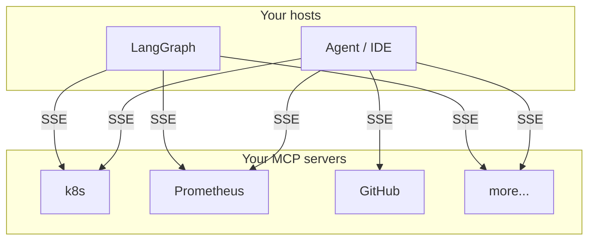
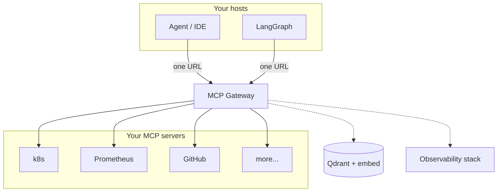

<div align="center">

<pre>
 ███╗   ███╗ ██████╗██████╗      ██████╗  █████╗ ████████╗███████╗██╗    ██╗ █████╗ ██╗   ██╗
 ████╗ ████║██╔════╝██╔══██╗    ██╔════╝ ██╔══██╗╚══██╔══╝██╔════╝██║    ██║██╔══██╗╚██╗ ██╔╝
 ██╔████╔██║██║     ██████╔╝    ██║  ███╗███████║   ██║   █████╗  ██║ █╗ ██║███████║ ╚████╔╝ 
 ██║╚██╔╝██║██║     ██╔═══╝     ██║   ██║██╔══██║   ██║   ██╔══╝  ██║███╗██║██╔══██║  ╚██╔╝  
 ██║ ╚═╝ ██║╚██████╗██║         ╚██████╔╝██║  ██║   ██║   ███████╗╚███╔███╔╝██║  ██║   ██║   
 ╚═╝     ╚═╝ ╚═════╝╚═╝          ╚═════╝ ╚═╝  ╚═╝   ╚═╝   ╚══════╝ ╚══╝╚══╝ ╚═╝  ╚═╝   ╚═╝   
</pre>

### MCP gives you a protocol. This gives you a **platform layer**.

**One URL for your host, many [MCP](https://modelcontextprotocol.io/) upstreams behind it**

<br/>

[](https://github.com/KarmaXP/mcp-gateway/actions/workflows/ci.yml?query=branch%3Amain)
[](scripts/check-coverage.sh)
[](LICENSE)
[](go.mod)
[](https://modelcontextprotocol.io/)
[](docs/ADDING_UPSTREAMS.md)
[](docs/artifacts/openapi/openapi.yaml)

<br/>

[**Why it exists**](#why-it-exists) · [**Run it**](#run-it-in-30-seconds) · [**For reviewers**](#for-reviewers) · [**Docs**](docs/README.md)

</div>

---

<div align="center">

## Why it exists

**MCP connects tools. Running them as a platform is a different problem.**

<br/>

[Model Context Protocol](https://modelcontextprotocol.io/) standardizes how a host talks to **one** MCP server on the wire.  
It does not merge catalogs across upstreams, enforce policy in one place, or route natural-language intent. **MCP Gateway** does.

<br/>

### Before

Each host opens its own SSE session to every MCP server.

</div>



<div align="center">

<br/>

### After

One URL merges catalogs, enforces policy, and routes calls for every host.

</div>



<div align="center">

<br/>

</div>

<table align="center" cellpadding="8">
<tr>
<td align="center" width="128">🔀<br/><b>Multiplex</b><br/><sub>HTTP · stdio</sub></td>
<td align="center" width="128">🏷️<br/><b>Namespace</b><br/><sub><code>prefix__tool</code></sub></td>
<td align="center" width="128">🧭<br/><b>Route</b><br/><sub>vectors + rules</sub></td>
<td align="center" width="128">🔒<br/><b>Secure</b><br/><sub>JWT · RAR · schema</sub></td>
<td align="center" width="128">📊<br/><b>Observe</b><br/><sub>traces · metrics</sub></td>
</tr>
</table>

<div align="center">

<br/>

<a href="docs/mcp-capabilities.md"><b>MCP method matrix</b></a> ·
<a href="docs/artifacts/openapi/openapi.yaml"><b>OpenAPI contract</b></a> ·
<a href="docs/architecture/README.md"><b>Architecture & ADRs</b></a>

</div>

---

<div align="center">

## Run it in 30 seconds

Built in Go **1.26+** · no Docker, no config files. Just proof that it works.

</div>

```bash
git clone https://github.com/KarmaXP/mcp-gateway.git
cd mcp-gateway
make demo
```

<div align="center">

You get a live gateway, a mock upstream, `initialize`, and `tools/call`, then a URL to hit.  
`make stop` when you're done.

</div>

<details>
<summary><b>Level up</b> · Docker, semantic router, real upstreams</summary>

```bash
make bootstrap          # .env from .env.example
make docker-up          # Qdrant, embed, OTel, Grafana
make run                # gateway on :8080 (or PORT in .env)
```

<table align="center" cellpadding="6">
<tr>
<th align="center">Target</th>
<th align="center">What happens</th>
</tr>
<tr>
<td align="center"><code>make demo-full</code></td>
<td align="center">Two mocks → <code>alpha__echo</code> through the gateway</td>
</tr>
<tr>
<td align="center"><code>make verify-e2e</code></td>
<td align="center">Full automated smoke (demo + multi-upstream + SRE)</td>
</tr>
<tr>
<td align="center"><code>make demo-lab-verify</code></td>
<td align="center">Lab rehearsal: real stdio upstreams + JWT + optional agent</td>
</tr>
<tr>
<td align="center"><code>make ci</code></td>
<td align="center">What GitHub Actions runs (lint, vet, <code>-race</code>)</td>
</tr>
</table>

<div align="center">

Ports, YAML profiles, JWT keys: <b><a href="docs/DEVELOPER.md">Developer guide</a></b> · <code>make help</code>

</div>

</details>

---

<div align="center">

## For reviewers

Measured runs with commits and replay commands in the linked docs.

<br/>

[-22c55e)](docs/evaluation/calibration-results.md)
[-22c55e)](docs/evaluation/calibration-results.md)
[](docs/evaluation/calibration-results.md)
[-0ea5e9)](docs/evaluation/calibration-results.md)
[](docs/evaluation/calibration-results.md)

</div>

<table align="center" cellpadding="6">
<tr>
<th align="center">What</th>
<th align="center">Where</th>
</tr>
<tr>
<td align="center"><b>Recorded results</b> (sessions, commits, commands)</td>
<td align="center"><a href="docs/evaluation/calibration-results.md">calibration-results.md</a></td>
</tr>
<tr>
<td align="center"><b>Formal eval protocol</b></td>
<td align="center"><a href="docs/evaluation/calibration-run.md">calibration-run.md</a> · <a href="docs/evaluation/README.md">evaluation index</a></td>
</tr>
<tr>
<td align="center"><b>Multiupstream + JWT walkthrough</b></td>
<td align="center"><a href="docs/evaluation/scenario-real-upstreams-jwt.md">scenario-real-upstreams-jwt.md</a></td>
</tr>
<tr>
<td align="center"><b>Agent host integration</b> (complementary)</td>
<td align="center"><a href="docs/evaluation/calibration-results.md">calibration-results.md</a> · <a href="docs/CONNECTING_AGENTS.md">Connecting agents</a></td>
</tr>
<tr>
<td align="center"><b>Design decisions</b></td>
<td align="center"><a href="docs/adr/">ADR index</a> · <a href="docs/architecture/mcp_gateway.plan.md">technical spec</a></td>
</tr>
<tr>
<td align="center"><b>One-command rehearsal</b></td>
<td align="center"><code>make demo-lab-verify</code></td>
</tr>
<tr>
<td align="center"><b>Automated regression</b></td>
<td align="center"><code>make verify-e2e</code> · <code>make ci</code></td>
</tr>
</table>

---

<div align="center">

## Jump in

</div>

<table align="center" cellpadding="6">
<tr>
<th align="center">You are…</th>
<th align="center">Start here</th>
</tr>
<tr>
<td align="center"><b>Curious</b> · show me it runs</td>
<td align="center"><a href="#run-it-in-30-seconds"><code>make demo</code></a></td>
</tr>
<tr>
<td align="center"><b>Integrating</b> · IDE, script, or agent host</td>
<td align="center"><a href="docs/CONNECTING_AGENTS.md">Connecting agents</a></td>
</tr>
<tr>
<td align="center"><b>Extending</b> · register upstream MCP servers</td>
<td align="center"><a href="docs/ADDING_UPSTREAMS.md">Adding upstreams</a></td>
</tr>
<tr>
<td align="center"><b>Operating</b> · config, deploy, observability</td>
<td align="center"><a href="docs/configuration.md">configuration</a> · <a href="docs/deployment.md">deployment</a> · <a href="docs/DEVELOPER.md">DEVELOPER</a></td>
</tr>
<tr>
<td align="center"><b>Debugging</b> · status codes & RPC errors</td>
<td align="center"><a href="docs/errors.md">errors</a></td>
</tr>
<tr>
<td align="center"><b>Deep dive</b> · full doc map</td>
<td align="center"><a href="docs/README.md"><b>docs/README.md</b></a></td>
</tr>
<tr>
<td align="center"><b>Contributing</b> · conventions & definition of done</td>
<td align="center"><a href="CONTRIBUTING.md">CONTRIBUTING</a></td>
</tr>
<tr>
<td align="center"><b>Reporting a vulnerability</b> · privately, never a public issue</td>
<td align="center"><a href="SECURITY.md">SECURITY</a></td>
</tr>
</table>

<div align="center">

<br/>

**MIT** · [LICENSE](LICENSE)

</div>
