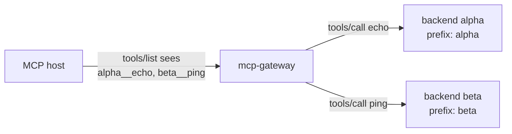
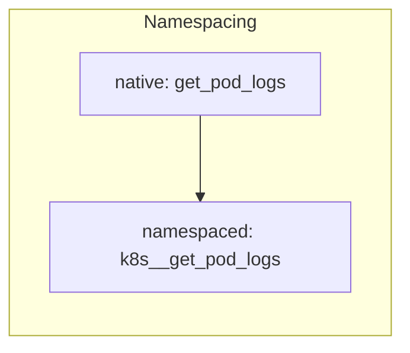
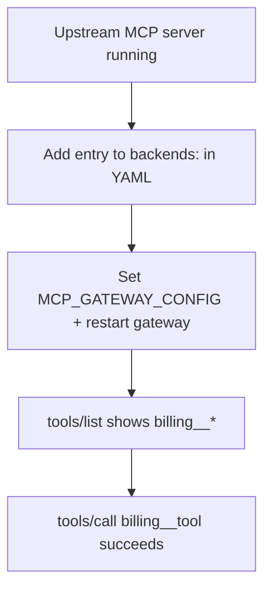
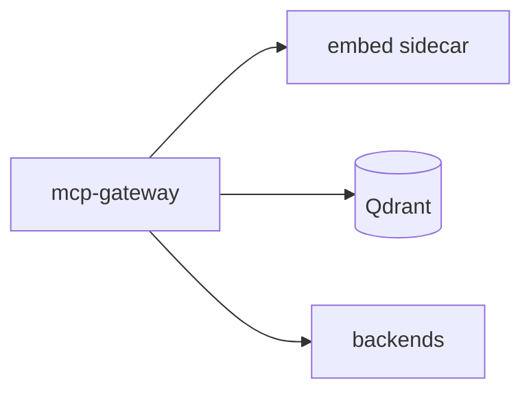

# Adding MCP backends

This guide explains how to register upstream MCP servers with the gateway so hosts see a single merged catalog (`prefix__tool` names).

**Prerequisites:** [README](../README.md) quick start (`make demo`), [configuration.md](configuration.md), and [local-ports.md](local-ports.md).

---

## How backends appear to hosts

| Concept | Meaning |
|---------|---------|
| **Backend** | One upstream MCP server (HTTP+SSE or stdio). |
| **`id`** | Stable gateway identifier (logs, traces, config). |
| **`prefix`** | Namespace for tools, e.g. `k8s` → `k8s__get_pod_logs`. |
| **Native tool name** | Name the upstream exposes, e.g. `get_pod_logs`. |
| **Namespaced name** | What the host uses: `prefix` + `__` + native name. |

The gateway strips the prefix on `tools/call` before forwarding to the upstream.





---

## Choose transport

### HTTP + SSE (recommended for remote services)

Use when the upstream exposes the same contract as this gateway:

- `GET /mcp/sse` → response header `Mcp-Session-Id`
- `POST /mcp/rpc` → `202 Accepted`; JSON-RPC results on the SSE stream

```yaml
backends:
 - id: my-service
  prefix: svc
  url: http://127.0.0.1:9000
  max_concurrency: 8
```

Optional upstream auth:

```yaml
  auth_token_env: MY_UPSTREAM_BEARER  # reads token from environment
  # or inline (avoid in git):
  # auth_token: "secret"
```

### Stdio (local processes)

Use for MCP servers that speak newline-delimited JSON-RPC on stdin/stdout (e.g. `npx` packages):

```yaml
backends:
 - id: local-everything
  prefix: demo
  command: ["npx", "-y", "@modelcontextprotocol/server-everything"]
  env:
   NODE_ENV: production
  max_concurrency: 2
```

The gateway spawns and manages the process per backend configuration.

---

## Configuration file

1. Copy a template:
  - Single backend, no router: [`deployments/gateway.demo.yaml`](../deployments/gateway.demo.yaml)
  - Two backends: [`deployments/gateway.example.yaml`](../deployments/gateway.example.yaml)
  - SRE-style three backends: [`deployments/gateway.sre.example.yaml`](../deployments/gateway.sre.example.yaml)

2. Point the gateway at your file:

```bash
export MCP_GATEWAY_CONFIG=deployments/my-gateway.yaml
make run
```

Or set `MCP_GATEWAY_CONFIG` in `.env` (see `make bootstrap`).

### Inline JSON (optional)

You can append backends via env (merged after YAML):

```bash
export MCP_GATEWAY_BACKENDS='[{"id":"alpha","prefix":"alpha","url":"http://127.0.0.1:3101","max_concurrency":8}]'
```

Prefer YAML for anything non-trivial.

---

## Step-by-step: add one HTTP backend

**Goal:** expose tools from `http://127.0.0.1:9000` under prefix `billing`.



1. **Ensure the upstream is running** and implements MCP HTTP+SSE on that URL.

2. **Edit YAML** (`deployments/my-gateway.yaml`):

```yaml
backends:
 - id: billing-api
  prefix: billing
  url: http://127.0.0.1:9000
  max_concurrency: 8

router:
 mode: off  # set to on only if Qdrant + embed are up; see DEVELOPER.md

qdrant:
 collection: mcp_tool_catalog

embed:
 url: http://127.0.0.1:8001
```

3. **Start the gateway:**

```bash
MCP_GATEWAY_CONFIG=deployments/my-gateway.yaml AUTH_MODE=none make run
```

4. **Verify from the host side** (see [CONNECTING_AGENTS.md](CONNECTING_AGENTS.md)) or use the included client:

```bash
GATEWAY_URL=http://127.0.0.1:8080 go run ./scripts/mcp_host_demo
```

Expect `tools/list` to include names like `billing__<native_tool>`.

5. **Call a tool:**

```bash
TOOL_NAME=billing__your_tool GATEWAY_URL=http://127.0.0.1:8080 go run ./scripts/mcp_host_demo
```

---

## Try with repo mocks (no external server)

| Mock | Command | Config |
|------|---------|--------|
| Single smoke upstream | (started by `make demo`) | `gateway.demo.yaml` |
| Alpha + beta | `make demo-backends` | `gateway.example.yaml` |
| k8s + prom + gh | `make sre-backends` | `gateway.sre.example.yaml` |
| Real stdio MCP (integrated lab) | `npx` servers via YAML `command` | [`gateway.real.yaml`](../deployments/gateway.real.yaml) |

Real-backend walkthrough: [scenario-real-backends-jwt.md](evaluation/scenario-real-backends-jwt.md).

```bash
make demo-backends
MCP_GATEWAY_CONFIG=deployments/gateway.example.yaml make run
# other terminal:
TOOL_NAME=alpha__echo go run ./scripts/mcp_host_demo
```

One-shot check: `make demo-full`.

---

## Semantic router (`router.mode: on`)



When the router is enabled, the gateway needs:

- `QDRANT_URL` (e.g. `http://127.0.0.1:6333`)
- `EMBED_URL` (e.g. `http://127.0.0.1:8001`)

Start dependencies: `make docker-up`, then your backends, then `make run`.

After backends change, the gateway re-indexes the tool catalog on the next `tools/list` (and when `forward_tools_list_changed` is configured). See [DEVELOPER.md — Configuration](DEVELOPER.md#configuration).

Minimal router-on YAML: [DEVELOPER.md — Minimal config](DEVELOPER.md#minimal-config-semantic-router-on).

---

## Aggregation and failures

Optional `aggregation:` block in YAML (see comments in `gateway.example.yaml`):

| Setting | Effect |
|---------|--------|
| Default | Failed upstreams omitted from `initialize` / list results; calls fail per backend. |
| `strict_initialize: true` | Any upstream init failure → error `-32005` to host. |
| `strict_list: true` | Any list failure → error `-32005`. |
| `report_partial_failures: true` | Successful merges include `extras.partial_failures`. |

`/readyz` checks Qdrant and embed when the router is active; it does **not** probe your MCP upstreams.

---

## Reload and restarts

| Change | Action |
|--------|--------|
| `policy:` block | `SIGHUP` reloads policy only. |
| `backends:` list | **Restart** the gateway process (`make stop` then `make run`). Mock upstreams keep running unless you run `make demo-backends-stop` or `make sre-down`. |
| Env (`ROUTER_MODE`, `QDRANT_URL`, …) | Restart. |

---

## Verification steps

- Unique `id` and `prefix` per backend.
- Upstream reachable (`url` or `command` works).
- Tools appear in `tools/list` with correct `prefix__` names.
- `tools/call` with namespaced name succeeds.
- If using JWT: token includes allowed `mcp_tools` or RAR entries for those names.

---

## Related docs

- [CONNECTING_AGENTS.md](CONNECTING_AGENTS.md): host / agent clients
- [configuration.md](configuration.md): env and YAML reference
- [local-ports.md](local-ports.md): local ports
- [deployment.md](deployment.md): Docker and production
- [evaluation/scenario-sre-multibackend.md](evaluation/scenario-sre-multibackend.md): multi-backend + router walkthrough
- [artifacts/openapi/openapi.yaml](artifacts/openapi/openapi.yaml): HTTP contract
