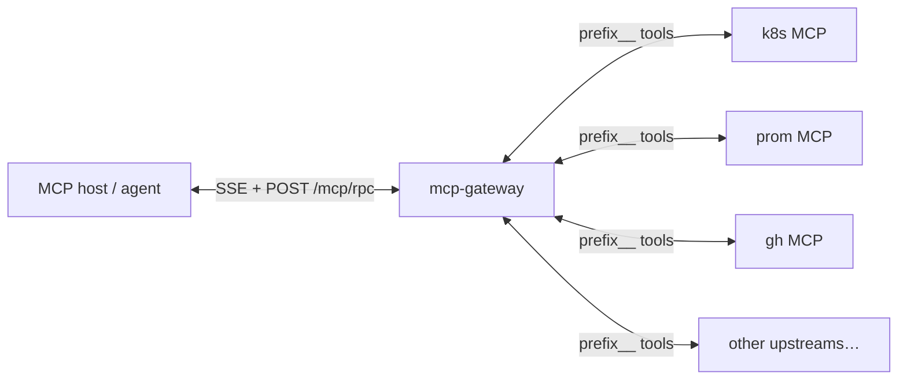
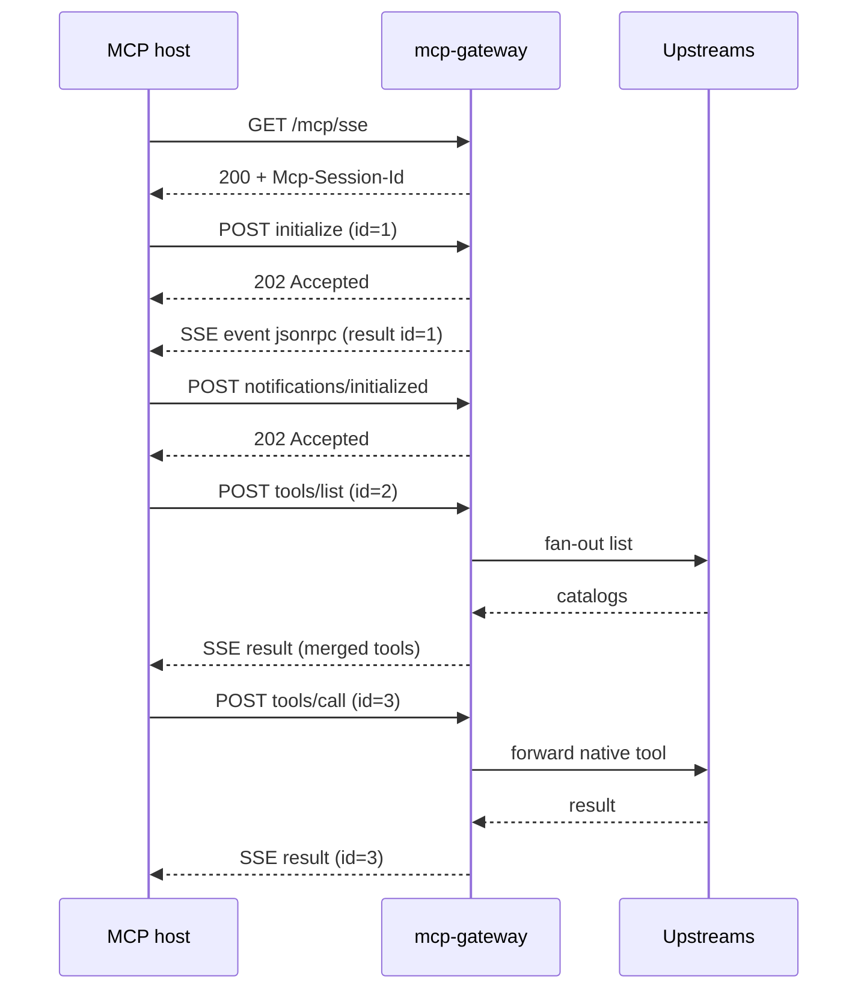
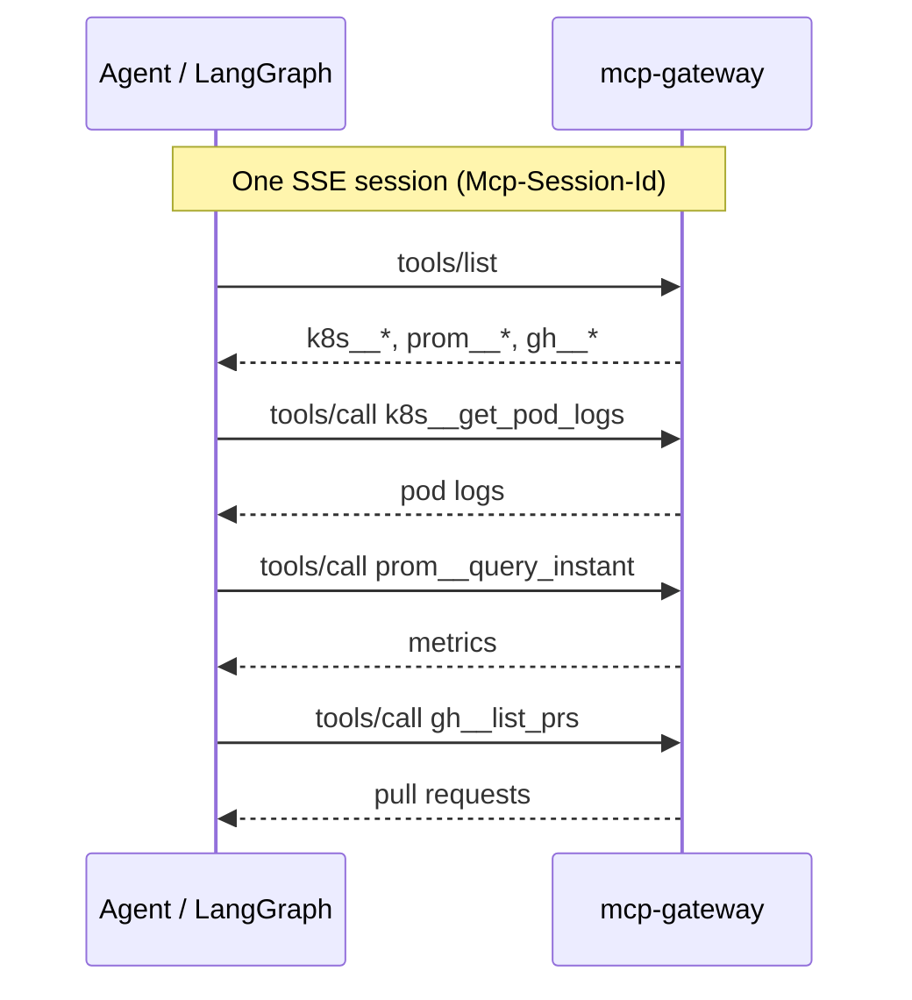
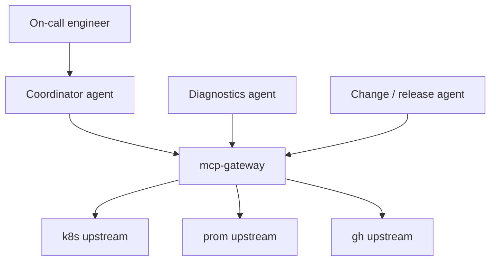

# Connecting agents and MCP hosts

This guide explains how any **MCP host** (IDE, script, or multi-step agent framework) talks to the gateway. The gateway is not an LLM; it multiplexes MCP traffic to your [upstreams](ADDING_UPSTREAMS.md).

**Contract reference:** [OpenAPI](artifacts/openapi/openapi.yaml) (authoritative for HTTP status, headers, and errors).

---

## Roles



| Role | Responsibility |
|------|----------------|
| **Host / agent** | Reasoning, tool choice, session with the gateway (this doc). |
| **Gateway** | Auth, merge catalogs, route ambiguous `tools/call`, forward RPCs. |
| **Upstream** | Real MCP tools (cluster API, metrics, GitHub, …). |

In the intended SRE setup, an external agent framework (for example LangGraph) acts as the host: graph nodes issue MCP calls through one gateway base URL. Implement the host in your own repository; this project supplies the gateway and reference clients only.

---

## Gateway URL

| Environment | Base URL |
|-------------|----------|
| Local dev (`make run`) | `http://127.0.0.1:8080` (or `PORT` from `.env`; see [local-ports.md](local-ports.md)) |
| Docker compose gateway profile | `http://127.0.0.1:${HOST_PORT_GATEWAY:-8080}` |

Endpoints:

| Method | Path | Purpose |
|--------|------|---------|
| `GET` | `/healthz` | Liveness |
| `GET` | `/readyz` | Readiness (Qdrant/embed when router on) |
| `GET` | `/mcp/sse` | Open session; read `Mcp-Session-Id` header |
| `POST` | `/mcp/rpc` | Send one JSON-RPC message per request |

**Protocol:** JSON-RPC **2.0** over HTTP; MCP revision **2024-11-05** in `initialize` (see [DEVELOPER.md — Protocol](DEVELOPER.md#protocol-and-dependencies) and [mcp-capabilities.md](mcp-capabilities.md)).

---

## Session flow (required)

Every host must follow this sequence:

1. **`GET /mcp/sse`** with `Accept: text/event-stream`. Keep the connection open.
2. Read response header **`Mcp-Session-Id`** (UUID).
3. **`POST /mcp/rpc`** with body `initialize` (include `id`). Read the **result on the SSE stream**, not in the POST body.
4. **`POST /mcp/rpc`** notification `notifications/initialized` (no `id`).
5. Call multiplexed methods (`tools/list`, `tools/call`, …) with the same `Mcp-Session-Id` on every POST.

For each request that has an `id`:

- POST returns **`202 Accepted`** (empty body).
- Matching **`result` or `error`** arrives on SSE as `event: jsonrpc` with one JSON object in `data:`.

Skipping step 4 causes **`HandshakeIncomplete` (-32001)** on later tool RPCs.



---

## Request headers

| Header | When | Purpose |
|--------|------|---------|
| `Mcp-Session-Id` | Every `POST /mcp/rpc` | Must match the SSE session from step 1. |
| `Content-Type: application/json` | Every POST | JSON-RPC body. |
| `Authorization: Bearer <JWT>` | When `AUTH_MODE=jwt` | Required on SSE and POST. |
| `X-MCP-Intent` | Optional on POST | Natural-language hint for semantic router / `filter_list` tools/list. |
| `X-Agent-Tokens-Used` | Optional on POST | Non-negative int; recorded on trace `mcp.agent.tokens_used`. |
| `traceparent` / `tracestate` | Optional | W3C trace propagation to upstreams. |

---

## Quick test with the included host client

The repo ships a minimal MCP host in Go (not an LLM agent):

```bash
# Terminal 1: gateway + upstreams
make demo-upstreams
MCP_GATEWAY_CONFIG=deployments/gateway.example.yaml AUTH_MODE=none make run

# Terminal 2: host client
GATEWAY_URL=http://127.0.0.1:8080 \
 TOOL_NAME=alpha__echo \
 go run ./cmd/mcp_host_demo
```

Details: [`cmd/mcp_host_demo/README.md`](../cmd/mcp_host_demo/README.md).

Smoke scripts (curl-based): `scripts/smoke_test.sh`, `scripts/smoke_e2e.sh`, `make sre-smoke`.

---

## Auth (`AUTH_MODE=jwt`)

1. Set `AUTH_MODE=jwt` and configure `JWT_PUBLIC_KEY_PEM` or `JWT_JWKS_URL` (see `.env.example`).
2. Send `Authorization: Bearer <token>` on **both** `GET /mcp/sse` and every `POST /mcp/rpc`.
3. Restrict tools with JWT claims:
  - `mcp_tools`: array of namespaced tool ids, e.g. `["k8s__get_pod_logs"]`, or `["*"]` for the whole catalog. A token with none of these three claims is allowed no tools.
  - `authorization_details`: RAR-style entries (see [ADR 0003](adr/0003-security-rar-jwt-merge-failmode.md))
  - `mcp_tool_groups`: expanded via `policy.tool_groups` in gateway YAML

`tools/call` on a tool not in the allow-list returns **`PermissionDenied` (-32003)** on the SSE stream, including when the semantic router is enabled (AuthZ on the **requested** name runs before routing).

Local dev without auth: `AUTH_MODE=none` (default in examples).

---

## Semantic routing

| `router.mode` / `ROUTER_MODE` | Host behavior |
|-------------------------------|---------------|
| `off` | Exact tool names only; full `tools/list`. |
| `on` / `assist_list` | Full `tools/list`; router may rewrite ambiguous `tools/call` names when `allow_auto_rename` is true. |
| `filter_list` | Narrowed `tools/list` when `X-MCP-Intent` is set; degrades to full catalog when routing is unavailable (JWT filter still applies). |

Requires `QDRANT_URL` and embed sidecar (`make docker-up`). Integration tests probe **`POST /embed`**, not only `/healthz`. See [Adding upstreams — Semantic router](ADDING_UPSTREAMS.md#semantic-router-routermode-on).

**Exact names win:** if the host sends `k8s__get_pod_logs` exactly, the gateway uses the deterministic path without vector search.

**Allow-list vs rename:** with `allow_auto_rename: false` (default), a disallowed tool name is rejected with **-32003** even if the router would have picked another tool. With `allow_auto_rename: true`, AuthZ applies to the **resolved** tool name after routing.

**Catalog change hints** (`notifications/tools/list_changed`) are best-effort on SSE; refresh with `tools/list` if a hint may have been dropped under load.

---

## SRE incident flow (target use case)

With upstreams and mocks from [ADDING_UPSTREAMS.md](ADDING_UPSTREAMS.md):

```bash
make sre-up
make sre-smoke
```

Manual MCP validation (three sessions, one tool each): [scenario-sre-multiupstream.md](evaluation/scenario-sre-multiupstream.md) (`scripts/smoke_e2e.sh`).

Typical agent sequence (same MCP session):



Walkthrough and traces: [evaluation/scenario-sre-multiupstream.md](evaluation/scenario-sre-multiupstream.md).

Canonical tool names: `k8s__get_pod_logs`, `prom__query_instant`, `gh__list_prs` (see [local-ports.md](local-ports.md)).

---

## Integrating LangGraph (or similar frameworks)

Integrate in **your agent project** by treating the gateway as a remote MCP server:

### 1. Configuration

```bash
export GATEWAY_URL=http://127.0.0.1:8080
```

Set `MCP_GATEWAY_CONFIG`, `ROUTER_MODE`, `QDRANT_URL`, and `EMBED_URL` on the **gateway process** only (not on the host client).

### 2. MCP client in the graph

Use any MCP client library that supports:

- Long-lived SSE (or your stack’s equivalent stream)
- POST per JSON-RPC message
- Session header `Mcp-Session-Id`

Wire one **tool node** (or shared client) to:

- Base URL = gateway
- Tool names = **namespaced** ids from `tools/list` (`k8s__get_pod_logs`, not `get_pod_logs`)

### 3. Multi-agent layout (recommended pattern)



| Agent node | Typical tools (via gateway) |
|------------|----------------------------|
| Coordinator | `tools/list`, delegates sub-goals |
| Diagnostics | `k8s__*`, `prom__*` |
| Change / release | `gh__*` |

All nodes share the **same gateway URL**; JWT/RAR can scope each principal to different `mcp_tools` if needed.

### 4. Intent header

For ambiguous natural-language tool selection, set on `tools/call` (and `filter_list` `tools/list`):

```http
X-MCP-Intent: high error rate on checkout service after deploy
```

### 5. Pseudocode shape

```python
session = mcp_client.connect_sse(f"{GATEWAY_URL}/mcp/sse", headers=auth_headers)
session.initialize()
session.notify_initialized()
tools = session.tools_list()
result = session.tools_call(
  name="k8s__get_pod_logs",
  arguments={"namespace": "prod", "pod": "checkout-0"},
  extra_headers={"X-MCP-Intent": user_message},
)
```

### 6. Verify before your agent runtime

Follow the **[integration checklist](evaluation/integration-checklist.md)** in one session (same gateway URL throughout):

1. Confirm upstreams and `tools/call` — SRE mock: `make sre-smoke` or [scenario-sre-multiupstream.md](evaluation/scenario-sre-multiupstream.md); multiupstream benchmark (real stdio + JWT): [scenario-real-upstreams-jwt.md](evaluation/scenario-real-upstreams-jwt.md).
2. Run `go run ./cmd/mcp_host_demo` with your `GATEWAY_URL` (and JWT when required).
3. JWT allow-list: [scenario-jwt-allowlist.md](evaluation/scenario-jwt-allowlist.md) / multiupstream benchmark walkthrough.
4. Loadtest (`AUTH_MODE=none`) or JWT loadtest (`-token` / `LOADTEST_JWT`, one worker) or JWT smoke + Prometheus. See [calibration-results.md](evaluation/calibration-results.md) and [errors.md](errors.md#known-limitations-multiplexing).
5. Wire your host to the same base URL, SSE session, and headers documented above.

---

## Other MCP-compatible hosts

Any client that speaks this gateway’s HTTP+SSE MCP binding can connect:

1. Register the gateway URL in the host’s MCP server settings.
2. Provide JWT if required.
3. Use namespaced tool names from `tools/list`.

Exact UI steps depend on the product; the wire contract is in [OpenAPI](artifacts/openapi/openapi.yaml).

---

## Troubleshooting

See also the **[error reference](errors.md)** for HTTP status codes and JSON-RPC codes.

| Symptom | Likely cause |
|---------|----------------|
| `-32001` HandshakeIncomplete | Missing `notifications/initialized`. |
| `404` on POST | Wrong or expired `Mcp-Session-Id`. |
| `401` | JWT missing/invalid or policy merge failed. |
| `-32003` PermissionDenied | Tool not in JWT/RAR allow-list. |
| `-32004` ToolRoutingAmbiguous | Router could not pick one tool; use exact name or clearer `X-MCP-Intent`. |
| Empty `tools/list` entry | Upstream down or returned `MethodNotFound` for list. |
| POST `202` but no SSE result | SSE connection closed or not read in parallel. |
| High loadtest errors under JWT with many workers | Concurrent `tools/list` fan-out; use `-workers 1`. See [errors.md](errors.md#known-limitations-multiplexing). |

---

## Related docs

- [ADDING_UPSTREAMS.md](ADDING_UPSTREAMS.md)
- [configuration.md](configuration.md)
- [errors.md](errors.md)
- [mcp-capabilities.md](mcp-capabilities.md)
- [DEVELOPER.md](DEVELOPER.md)
- [README.md](README.md): documentation index
