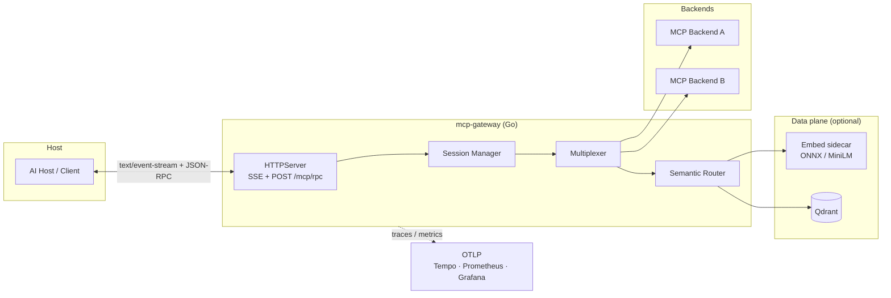

# MCP Gateway — developer & operator guide

Technical reference for this repository: architecture, configuration, API contract, observability, CI, and contribution guardrails. For a non-technical overview of MCP and this project, start with the [root README](../README.md).

## Architecture



- **Ingress:** `GET /mcp/sse` opens the session; JSON-RPC **responses** (for requests with `id`) are pushed as **SSE named events** `event: jsonrpc` with a single-line JSON-RPC object in `data:` (see OpenAPI). `POST /mcp/rpc` accepts one request per call (`202` when accepted).
- **Intent for routing:** Optional header **`X-MCP-Intent`** on `POST /mcp/rpc` is stored in `hostctx` and forwarded as `RoutingSignal.IntentText` for **`tools/call`** and, when `ROUTER_MODE=filter_list`, for **`tools/list`** subsetting. Omitted header means empty intent (see below).
- **Agent token metadata:** Optional header **`X-Agent-Tokens-Used`** on `POST /mcp/rpc` (non-negative integer) is recorded on the host request span as OTel attribute **`mcp.agent.tokens_used`** when valid. Empty or invalid values are ignored.
- **Core:** `internal/gateway/multiplex` (`Multiplexer`) merges `initialize` and `tools/list`; `tools/call` is forwarded with stable namespacing (`prefix__tool`).
- **Router:** `internal/router` optionally rewrites ambiguous tool names using embeddings + vector search (see [ADR 0001](adr/0001-architecture-decisions.md)). **`filter_list`** (intent-filtered `tools/list`) is implemented behind `ROUTER_MODE=filter_list` / `router.mode: filter_list` — [ADR 0002](adr/0002-filter-list-mode.md). With **`filter_list`**, empty intent returns the **full** merged catalog (after JWT/RAR allow-list only), same as `assist_list` for that request; there is no reuse of intent from earlier RPCs. Vector/embed failures or catalog/index mismatch **degrade** to the full allow-listed catalog (warn logs).
- **Security (RAR ∩ JWT, fail mode):** [ADR 0003](adr/0003-security-rar-jwt-merge-failmode.md) documents the canonical `authorization_details` shape for MCP tools, merge rules for JWT vs RAR allow lists, and fail-closed vs opt-in degradation. [ADR 0004](adr/0004-gateway-scope.md) defines method scope boundaries: JWT/RAR AuthZ is tools-only; `resources/*` and `prompts/*` are pass-through after AuthN.

## Why this stack

| Choice | Why |
|--------|-----|
| **Go** | Small static binary, excellent concurrency, fast JSON-RPC and HTTP, first-class context cancellation for timeouts and graceful shutdown—fits SRE-style services and low-latency gateways. |
| **Qdrant** | Fast filtered ANN search over tool vectors; clear HTTP API and Docker story; supports catalog versioning and explainable candidates. |
| **ONNX / local embeddings** | Keeps routing signals on-prem, removes per-call embedding API cost and tail latency from the public internet, and simplifies air-gapped or CI runs (privacy + predictability). |

## Quick start (Makefile)

From the **module root** (`mcp-gateway/`):

```bash
make help
```

Typical flow:

```bash
make docker-up          # Qdrant, embed sidecar, OTel collector, Tempo, Prometheus, Grafana
make run                # gateway on PORT / GATEWAY_PORT (default 18080 with .env patterns)
make test               # vet + race + unit tests
make ci                 # same as GitHub Actions lint-and-unit (lint + vet + race, -count=1)
make test-integration   # needs compose (Qdrant + embed); see below
make lint
make smoke              # end-to-end curl + optional auto-start gateway
```

### OpenAPI

Spec: [`artifacts/openapi/openapi.yaml`](artifacts/openapi/openapi.yaml) — required headers (`Authorization` when `AUTH_MODE=jwt`), optional `X-MCP-Intent`, W3C **`traceparent` / `tracestate`**, JWT claims (`iss`, `aud`, `exp`, `mcp_tools`, `authorization_details` / RAR), HTTP status semantics vs JSON-RPC errors on SSE, multiplexed MCP methods (**`tools/*`**, **`resources/*`**, **`prompts/*`**), and example **`tools/call`** allow/deny payloads. Gateway error code names match [`internal/gateway/errcodes`](../internal/gateway/errcodes/codes.go).

### Lint the OpenAPI file (Redocly)

```bash
npx --yes @redocly/cli@1 lint --config docs/artifacts/openapi/redocly.yaml docs/artifacts/openapi/openapi.yaml
```

## Configuration highlights

- **Backends:** `MCP_GATEWAY_CONFIG` (YAML) and/or `MCP_GATEWAY_BACKENDS` (JSON list). Each entry has `id`, `prefix`, and either `url` (HTTP+SSE MCP) or `command` (stdio). See [`deployments/gateway.example.yaml`](../deployments/gateway.example.yaml).
- **Multiplexed MCP methods:** **`tools/list`** / **`tools/call`** (merged tool catalog, `prefix__` namespacing); **`resources/list`** / **`resources/read`** (resource `uri` values use the same `prefix__` convention; upstream URIs containing `__` are encoded—see `namespace.JoinOpaque` / OpenAPI notes); **`prompts/list`** / **`prompts/get`** (prompt `name` namespaced like tools). Backends that return **`MethodNotFound`** for list methods are omitted from that aggregate (default). **`aggregation.strict_initialize`** / **`aggregation.strict_list`** (YAML) or **`AGGREGATION_STRICT_INITIALIZE`** / **`AGGREGATION_STRICT_LIST`** (env) opt in to **fail-closed** behavior: any upstream transport or JSON-RPC failure on `initialize`, or any list failure on `tools/list` / `resources/list` / `prompts/list`, surfaces **`StrictAggregationFailed` (-32005)** to the host instead of partial results. **`aggregation.forward_tools_list_changed`** (full YAML path; field name `forward_tools_list_changed` inside `aggregation`) forwards tools catalog change notifications and applies **tools-only** side-effects: invalidate tools list cache, trigger router reindex, and broadcast tool-catalog updates to active host SSE sessions.
- **Session tool history:** After each **successful** **`tools/call`**, the gateway keeps the last **N** resolved namespaced tool names per SSE session (`internal/defaults`: **`SessionToolHistoryMax`**, default 8) and passes them to the semantic router as **`RecentToolNames`** so near-tie vector ambiguity can prefer the tool invoked most recently—hosts do not send extra fields.
- **Auth:** `AUTH_MODE=none|jwt` — JWT validates RS256 (PEM or JWKS). Health paths are skipped by default. JWKS fetch or signature failure is **fail-closed** (401). Optional JWT claim **`mcp_tools`** (array of namespaced tool ids): restricts **`tools/list`** to that subset (metadata leak reduction), enforces the same allow-list on **`tools/call`** (returns **`PermissionDenied` (-32003)** if the tool is not listed), and feeds the semantic router vector filter. Optional **`authorization_details`** (RAR-style) and **`mcp_tool_groups`** merge per `internal/policy` and gateway YAML `policy:`. JWT/RAR allow-list enforcement in the gateway currently applies to **`tools/*`** only (not `resources/*` or `prompts/*`; those are pass-through after AuthN). **`tools/call`** arguments are bounded (size/depth/keys) then validated against each tool’s aggregated **`inputSchema`** when present; tools listed under **`policy.elevated_tools`** require a compiled schema (**SEC3**). Schema validation errors returned to the host omit instance values (**SEC5**). **`POST /mcp/rpc`** uses **`MaxBytesReader`** (413 if over limit). Optional **`RATE_LIMIT_*`** (see `.env.example`) applies a per-subject or per-IP token bucket after auth. **`GET /mcp/sse`** emits periodic **comment keepalives** (`: keepalive`) for proxy/TCP hygiene. See OpenAPI `bearerAuth` and `.env.example`.
- **Security degradation flags:** two explicit paths exist. `policy.allow_on_eval_failure` (YAML) / `POLICY_ALLOW_ON_EVAL_FAILURE` (env) is an opt-in degradation for malformed/unparseable RAR `authorization_details`: request handling falls back to JWT-only allow lists (`mcp_tools` / `mcp_tool_groups`) instead of 401. JWKS availability remains fail-closed by design (SEC7): there is currently **no** `AUTH_ALLOW_JWKS_UNAVAILABLE` bypass flag. Use `AUTH_MODE=none` only for intentional local-dev insecure mode.
- **Semantic router:** `ROUTER_MODE=on`, `assist_list`, or **`filter_list`** requires **`QDRANT_URL`**; tune with `ROUTER_*` env vars or the `router:` block in YAML (`top_k`, `score_min`, `allow_auto_rename`, timeouts, `vector_dim`). `EMBED_URL` / `embed.url` points at the embedding sidecar. Modes: **`on`** / **`assist_list`** — full `tools/list`; **`filter_list`** — `tools/list` narrowed by `X-MCP-Intent` when the header is non-empty (policy and vector filters still apply).
- **Telemetry:** `OTEL_EXPORTER_OTLP_ENDPOINT` (e.g. `http://127.0.0.1:4318`) — traces and metrics export via OTLP HTTP.
- **Policy reload:** sending **`SIGHUP`** to the gateway process re-reads **`MCP_GATEWAY_CONFIG`** (`config.Load()`), then reloads only the in-memory **`policy.Engine`** via `policy.ReloadEngine`. This applies policy changes on the next authenticated **`POST /mcp/rpc`** without requiring a new SSE connection; hosts that cache **`tools/list`** locally may still want to refresh after a policy change. **Not reloaded on SIGHUP today:** `rate_limit`, `gateway.allowed_origins`, `aggregation` (including `max_in_flight`), `policy.audit_sink`, `backends`, and other process wiring created at startup. See [ADR 0003](adr/0003-security-rar-jwt-merge-failmode.md) §Decision 4. Structured policy audit events go through **`policy.AuditSink`** (default: slog + metrics); use **`policy.SetAuditSink`** for tests or alternate sinks.

## Protocol and dependencies

- **MCP protocol revision:** `2024-11-05` (pinned in `internal/gateway/mcpwire/protocol.go` as `MCPProtocolVersion`).

Direct Go dependencies (`go.mod`) at a glance:

| Module | Purpose | Version |
|--------|---------|---------|
| `github.com/golang-jwt/jwt/v5` | JWT parsing/validation in auth middleware | `v5.2.1` |
| `github.com/google/uuid` | Session UUID generation and IDs | `v1.6.0` |
| `github.com/lestrrat-go/jwx/v2` | JWKS/JWK handling for JWT verification | `v2.1.3` |
| `github.com/santhosh-tekuri/jsonschema/v6` | JSON Schema validation for `tools/call` arguments | `v6.0.2` |
| `gopkg.in/yaml.v3` | YAML config loading | `v3.0.1` |
| `go.opentelemetry.io/otel` family | OTel traces/metrics SDK and OTLP exporters | `v1.35.0` (`otelhttp v0.60.0`) |
| `golang.org/x/sync` | Concurrency primitives (`errgroup`, semaphores) | `v0.20.0` |

## Health and readiness semantics

- `GET /healthz` is process liveness only and always returns `200 ok` when the HTTP server is running.
- `GET /readyz` returns `200 ok` by default, and when semantic routing is active (`router.mode` / `ROUTER_MODE` set to `on`, `assist_list`, or `filter_list`) it performs dependency probes before declaring ready:
  - Qdrant: `QDRANT_URL/readyz`, then fallback to `QDRANT_URL/healthz` if `/readyz` is unavailable.
  - Embed sidecar: `EMBED_URL/healthz`.
- Probes use short per-request timeouts and return `503` with a hint (`not ready: ...`) if any required dependency is not healthy.
- Upstream MCP backends are intentionally not probed from `/readyz`: there is no universal, side-effect-free readiness endpoint across stdio and HTTP upstream transports, and a failing backend is handled as partial failure at request time.

## Observability (Prometheus · Grafana · Tempo)

With `make docker-up`, Compose brings up a minimal observability stack (exact service names and ports are in `deployments/docker-compose.yaml`):

- **Prometheus** scrapes gateway-relevant targets where configured.
- **Grafana** dashboards for metrics; **Tempo** receives traces from the OpenTelemetry Collector.
- Application metrics include semantic router outcomes and latency (`mcp.gateway.semantic_router.*`) with **`layer`** labels (`exact`, `rules`, `vector`, …), **`indexed_tools`** (gauge after each successful catalog reindex), and an **active SSE sessions** gauge (`mcp.gateway.active_sse_sessions`). **Internal hop** time (gateway-only, excludes upstream MCP I/O) is recorded as a histogram **`mcp.gateway.internal.duration_seconds`** with labels **`method`** (JSON-RPC method when known; `unknown` during JWT on `POST /mcp/rpc` before parse) and **`phase`**: `parse`, `security`, `router`, `mux`. Use phase histograms to track **p95** against the plan §6 internal budget (50 ms p95 goal for gateway-only work; see [calibration runbook](evaluation/calibration-run.md)); Prometheus scrape names may appear as `mcp_gateway_internal_duration_seconds_*` after translation.
- Traces: child span **`mcp.security.authn`** wraps JWT validation (under **`mcp.host.request`** for `POST /mcp/rpc` when `AUTH_MODE=jwt`); **`mcp.security.authz`** remains on `tools/call` allow-list enforcement in the multiplexer.
- Tracing policy decisions (closed): each processed JSON-RPC message creates exactly one root span, **`mcp.host.request`**.
- W3C propagation policy (closed): `traceparent` / `tracestate` are always propagated on outgoing HTTP upstream backend calls.
- Agent token policy (closed): `X-Agent-Tokens-Used` is recorded only as span attribute **`mcp.agent.tokens_used`** when valid; there is no Prometheus token-usage metric (O5).
- **Security-oriented counters** (low-cardinality labels only; no user IDs or request IDs — O5): `mcp.gateway.policy.decisions`, `mcp.gateway.auth.jwks.lookups`, `mcp.gateway.tool_args.validation`, `mcp.gateway.ratelimit.events`, `mcp.gateway.payload.bytes_rejected`. Label enums are defined in `internal/defaults/metrics.go`. Import [`artifacts/grafana/mcp-gateway-observability.json`](artifacts/grafana/mcp-gateway-observability.json) for a **Security** row with PromQL regex matchers.

Example PromQL (Grafana “Security” row, rate over 5m):

```promql
sum by (outcome, reason) (rate(mcp_gateway_policy_decisions_total[5m]))
sum by (result) (rate(mcp_gateway_auth_jwks_lookups_total[5m]))
sum by (stage, result) (rate(mcp_gateway_tool_args_validation_total[5m]))
sum by (result) (rate(mcp_gateway_ratelimit_events_total[5m]))
sum by (reason) (rate(mcp_gateway_payload_bytes_rejected_total[5m]))
```

(Prometheus scrape names may use `_total` suffix and dots mapped to underscores depending on exporter config; align queries with your OTel → Prometheus translation.)

### Metric cardinality

Prometheus-facing metrics in this repo intentionally use bounded label sets:

- `mcp.gateway.internal.duration_seconds` -> `method`, `phase`
- `mcp.gateway.semantic_router.outcomes` / `duration_seconds` -> `result`, `outcome`, `layer`
- `mcp.gateway.policy.decisions` -> `outcome`, `reason`
- `mcp.gateway.auth.jwks.lookups` -> `result`
- `mcp.gateway.tool_args.validation` -> `stage`, `result`
- `mcp.gateway.ratelimit.events` -> `result`
- `mcp.gateway.payload.bytes_rejected` -> `reason`

Policy for new metrics:

- Do not add unbounded labels (request IDs, subjects, raw intent text, full tool names).
- Keep counters/histograms at bounded enums; put tool-level detail on spans instead.
- `mcp.tool.name` is currently a span attribute (`internal/telemetry/attrs.go` and multiplexer span instrumentation), not a Prometheus metric label.
- `mcp.backend.id` is currently a span attribute for backend call tracing, not a metric label.

### Log correlation

The gateway writes structured JSON logs to stdout (`slog.NewJSONHandler(os.Stdout, ...)` in `cmd/gateway/main.go`) and wraps the handler with `telemetry.TraceHandler`.

| Field | Status | Source / notes |
|------|--------|----------------|
| `trace_id` | Required for trace correlation | Added by `internal/telemetry/slog.go` when a valid span is present in context. |
| `span_id` | Recommended (and emitted) | Added by `internal/telemetry/slog.go`; useful when jumping to a specific span within a trace. |
| `service.name` | Required in traces; optional in raw log line | Present on OTel resource for traces/metrics; if needed as a log field, add it in your log shipper or logger attrs. |
| `mcp.method` | Optional in logs, required on spans | Emitted as span attribute on request handling; default dispatch warning logs currently include `msg="dispatch"` and `err` but not `mcp.method`. |

Grafana provisioning links Prometheus exemplars field `trace_id` to the Tempo datasource (`deployments/grafana/provisioning/datasources/datasources.yaml`), so `trace_id` in logs and exemplars is the primary correlation key.

## Repository layout

Standard Go layout: `cmd/`, `internal/`, `deployments/`, `docs/`, `scripts/`. Public reusable libraries would live under `pkg/` if added; this module is primarily an application.

## Code quality guardrail (defaults, performance, structure)

- Runtime numeric defaults and limits are centralized in `internal/defaults`.
- MCP wire/protocol strings are centralized in `internal/gateway/mcpwire`.
- Do not introduce raw numeric literals for tunable behavior in production code; use named constants/defaults.
- CI lint includes `mnd` to catch newly introduced magic numbers in non-test Go code.
- **Performance on hot paths** (`tools/list`, `tools/call`, semantic reindex, vector query): avoid unmarshaling or marshaling the same catalog payload twice when maps or rows are already in memory; use appropriate sorting (`sort.Slice` vs nested loops), preallocate when size is known, and reuse derived text (e.g. formatted tool docs) across embedding and rerank. See `.ai/rules/first-pass-quality.md` section 7 (in the parent workspace).
- **Readability:** prefer short functions with one responsibility and split large types across focused files in the same package (e.g. `tools_list.go`, `semantic_router_resolve.go`) rather than growing a single source file. See `.ai/rules/first-pass-quality.md` section 8 and `.ai/rules/go.md`.

## Continuous integration

GitHub Actions: [`.github/workflows/ci.yml`](../.github/workflows/ci.yml).

- **On every `push`, `pull_request`, and `workflow_dispatch`:** `lint-and-unit` runs `golangci-lint`, `go vet ./...`, and `go test -race -count=1 ./...`.
- **On every `push`, `pull_request`, and `workflow_dispatch`:** `smoke` runs `scripts/smoke_test.sh` (`SMOKE_AUTO_START_GATEWAY=1`) as a no-Docker MCP handshake/tools gate.
- **On every `push`, `pull_request`, and `workflow_dispatch`:** `integration` starts **Qdrant**, **embed**, and **otel-collector** from [`deployments/docker-compose.yaml`](../deployments/docker-compose.yaml) and runs `go test -tags=integration -race -count=1` for `internal/gateway/httpserver`, `internal/router`, and `internal/telemetry`.
- **Only on `workflow_dispatch`:** optional `perf-gate` starts the compose stack (including gateway + Prometheus) and runs `scripts/check_gateway_p95.sh` with a conservative threshold (`P95_THRESHOLD_MS=120`). It is manual-only and does not block regular PR/push CI. The job sets `SKIP_IF_NO_METRICS=1` and `ALLOW_LOADTEST_FALLBACK=0` so missing internal histogram series becomes a documented skip instead of a hard failure.
- **PR gate:** both `smoke` and `integration` run on pull requests, so wire regressions are caught before merge.

## Full integration tests locally

`make test-integration` runs `go vet` and integration-tagged tests with defaults aimed at compose-mapped ports (`QDRANT_URL`, `EMBED_URL`, `OTEL_EXPORTER_OTLP_ENDPOINT`).

1. **Dependencies (recommended):** `make docker-up` — brings up Qdrant, embed sidecar, Otel collector (and the rest of the dev stack). Wait until Qdrant (`http://127.0.0.1:6333/healthz`) and embed (`http://127.0.0.1:8001/healthz`) are healthy.
2. **Run:** `make test-integration`.
3. **Behavior:**
   - **`internal/gateway/httpserver`:** JWT **`mcp_tools`** allow-list denial for **`tools/call`** is always exercised (in-process `httptest`; no external services).
   - **`internal/router`:** semantic routing against live Qdrant + embed runs when both are reachable; if either is down and **`CI` is unset**, the test **skips** with a clear message (on CI, missing deps **fail** the job).
   - **`internal/telemetry`:** OTLP shutdown test runs when the collector answers at `OTEL_EXPORTER_OTLP_ENDPOINT`; otherwise it **skips**.

Use **`go test -tags=integration -short ./...`** to skip tests that call `testing.Short()` (currently the JWT policy integration test).

## Further reading

- [Architecture plan](architecture/mcp_gateway.plan.md) — full specification.
- [ADRs](adr/) — decisions including [ADR 0001](adr/0001-architecture-decisions.md), [ADR 0002](adr/0002-filter-list-mode.md), [ADR 0003](adr/0003-security-rar-jwt-merge-failmode.md), and [ADR 0004](adr/0004-gateway-scope.md).
- [Calibration runbook](evaluation/calibration-run.md) — live embedding + Qdrant numbers.
