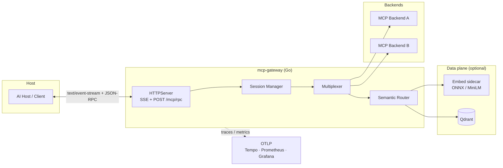

# MCP Gateway: developer & operator guide

Technical reference for operators and contributors: architecture, observability, CI, and guardrails. For a guided map of all docs, see **[docs/README.md](README.md)**.

**Quick links:** [configuration](configuration.md) · [errors](errors.md) · [MCP capabilities](mcp-capabilities.md) · [deployment](deployment.md)

For a non-technical overview, start with the [root README](../README.md).

**Extension guides (clone → extend → integrate):**

| Guide | Use when |
|-------|----------|
| [ADDING_BACKENDS.md](ADDING_BACKENDS.md) | Register HTTP or stdio MCP upstreams in YAML |
| [CONNECTING_AGENTS.md](CONNECTING_AGENTS.md) | Connect an MCP host, script, or LangGraph-style agent to the gateway |

## Architecture



- **Ingress:** `GET /mcp/sse` opens the session; JSON-RPC **responses** (for requests with `id`) are pushed as **SSE named events** `event: jsonrpc` with a single-line JSON-RPC object in `data:` (see OpenAPI). `POST /mcp/rpc` returns **`202 Accepted`** when the request is queued for that session; the JSON-RPC **result or error** is delivered on the SSE stream (not in the HTTP response body).
- **Intent for routing:** Optional header **`X-MCP-Intent`** on `POST /mcp/rpc` is stored in `hostctx` and forwarded as `RoutingSignal.IntentText` for **`tools/call`** and, when `ROUTER_MODE=filter_list`, for **`tools/list`** subsetting. Omitted header means empty intent (see below).
- **Agent token metadata:** Optional header **`X-Agent-Tokens-Used`** on `POST /mcp/rpc` (non-negative integer) is recorded on the host request span as OTel attribute **`mcp.agent.tokens_used`** when valid. Empty or invalid values are ignored.
- **Core:** `internal/gateway/multiplex` (`Multiplexer`) merges `initialize` and `tools/list`; `tools/call` is forwarded with stable namespacing (`prefix__tool`).
- **Router:** `internal/router` optionally rewrites ambiguous tool names using embeddings + vector search (see [ADR 0001](adr/0001-architecture-decisions.md)). **`filter_list`** (intent-filtered `tools/list`) is implemented behind `ROUTER_MODE=filter_list` / `router.mode: filter_list`, [ADR 0002](adr/0002-filter-list-mode.md). With **`filter_list`**, empty intent returns the **full** merged catalog (after JWT/RAR allow-list only), same as `assist_list` for that request; there is no reuse of intent from earlier RPCs. Vector/embed failures or catalog/index mismatch **degrade** to the full allow-listed catalog (warn logs).
- **Security (RAR ∩ JWT, fail mode):** [ADR 0003](adr/0003-security-rar-jwt-merge-failmode.md) documents the canonical `authorization_details` shape for MCP tools, merge rules for JWT vs RAR allow lists, and fail-closed vs opt-in degradation. **Empty JWT `mcp_tools` allow-list** (after merge) exposes the **full merged tool catalog** (SEC2 — intentional for dev; lock down in production). [ADR 0004](adr/0004-gateway-scope.md) defines method scope boundaries: JWT/RAR AuthZ is **tools-only**; `resources/*` and `prompts/*` are pass-through after AuthN (no change planned unless a new ADR says otherwise).

## Why this stack

| Choice | Why |
|--------|-----|
| **Go** | Small static binary, excellent concurrency, fast JSON-RPC and HTTP, first-class context cancellation for timeouts and graceful shutdown, fits SRE-style services and low-latency gateways. |
| **Qdrant** | Fast filtered ANN search over tool vectors; clear HTTP API and Docker story; supports catalog versioning and explainable candidates. |
| **ONNX / local embeddings** | Keeps routing signals on-prem, removes per-call embedding API cost and tail latency from the public internet, and simplifies air-gapped or CI runs (privacy + predictability). |

## Quick start (Makefile)

From the **module root** (`mcp-gateway/`):

```bash
make help
make demo        # recommended first run: no Docker, E2E MCP on localhost
```

### Local ports

| Port | Service | When |
|------|---------|------|
| **8080** (or `.env` override, e.g. `18080`) | Gateway (`PORT` / `GATEWAY_PORT`) | `make run`, `make stop` (both read `.env`) |
| **18081** | Gateway (smoke auto-start only) | `make demo` / `make smoke` with `SMOKE_AUTO_START_GATEWAY=1` |
| **18082** | Gateway (JWT smoke) | `scripts/smoke_jwt.sh`; freed by `make stop` |
| **31400** | `scripts/smoke_upstream` | Default upstream for `deployments/gateway.demo.yaml` |
| **3101** / **3102** | Alpha / beta mocks | Host: `gateway.example.yaml` + `make demo-backends`. Compose gateway: `gateway.example.docker.yaml` |
| **3201, 3203** | SRE mocks (k8s / prom / gh) | `gateway.sre.example.yaml` after `make sre-backends` or `make docker-up-sre` |

See [`docs/local-ports.md`](local-ports.md) for the port and mock upstream reference.

Typical flows:

```bash
make demo        # smoke upstream :31400 + gateway :18081 + MCP curl (no Docker)
make demo-full     # alpha/beta mocks + gateway.example.yaml + alpha__echo (no Docker)
make demo-backends   # only mocks on 3101/3102 (pair with make run + gateway.example.yaml)
make sre-up       # docker-up + SRE mocks on 3201–3203 (Qdrant + embed required for router on)
make sre-smoke     # three tools/call: k8s__get_pod_logs, prom__query_instant, gh__list_prs
make verify-e2e     # CI + demo + demo-full + sre-smoke (full local E2E check)
make bootstrap     # .env from .env.example if missing
make docker-up     # Qdrant, embed sidecar, OTel collector, Tempo, Prometheus, Grafana
make docker-up-demo   # compose profile demo: mock-alpha / mock-beta (3101/3102 on host)
make run        # gateway on PORT from .env (default 8080); MCP_GATEWAY_CONFIG=gateway.demo.yaml unless set
make stop       # kills gateway listeners only; use demo-backends-stop / sre-down for mocks
make test        # vet + race + unit tests
make ci         # same as GitHub Actions lint-and-unit (lint + vet + race, -count=1)
make test-integration  # needs compose (Qdrant + embed); see below
make lint
make smoke       # same core checks as demo (temporary config file)
```

Default config for new users: [`deployments/gateway.demo.yaml`](../deployments/gateway.demo.yaml). Multi-backend template: [`deployments/gateway.example.yaml`](../deployments/gateway.example.yaml).

### Minimal config (semantic router on)

For `router.mode: on` you need Qdrant and the embed sidecar (`make docker-up`), plus HTTP backends you can reach (e.g. `make demo-backends` for alpha/beta on **3101** / **3102**):

```yaml
backends:
 - id: backend-alpha
  prefix: alpha
  url: http://mock-alpha:3101   # in compose; on host use 127.0.0.1:3101 or /etc/hosts aliases
 - id: backend-beta
  prefix: beta
  url: http://mock-beta:3102
router:
 mode: on
qdrant:
 collection: mcp_tool_catalog
embed:
 url: http://127.0.0.1:8001
```

Required environment (in addition to `PORT` / `AUTH_MODE` as needed):

| Variable | Example |
|----------|---------|
| `MCP_GATEWAY_CONFIG` | `deployments/gateway.example.yaml` |
| `QDRANT_URL` | `http://127.0.0.1:6333` |
| `EMBED_URL` | `http://127.0.0.1:8001` |

Host client against multi-backend: `make demo-backends`, then `MCP_GATEWAY_CONFIG=deployments/gateway.example.yaml make run` in another terminal, then `TOOL_NAME=alpha__echo go run ./scripts/mcp_host_demo` (see [`scripts/mcp_host_demo/README.md`](../scripts/mcp_host_demo/README.md)).

### OpenAPI

Spec: [`artifacts/openapi/openapi.yaml`](artifacts/openapi/openapi.yaml): required headers (`Authorization` when `AUTH_MODE=jwt`), optional `X-MCP-Intent`, W3C **`traceparent` / `tracestate`**, JWT claims (`iss`, `aud`, `exp`, `mcp_tools`, `authorization_details` / RAR), HTTP status semantics vs JSON-RPC errors on SSE, multiplexed MCP methods (**`tools/*`**, **`resources/*`**, **`prompts/*`**), and example **`tools/call`** allow/deny payloads. Gateway error code names match [`internal/gateway/errcodes`](../internal/gateway/errcodes/codes.go).

### Lint the OpenAPI file (Redocly)

```bash
npx --yes @redocly/cli@1 lint --config docs/artifacts/openapi/redocly.yaml docs/artifacts/openapi/openapi.yaml
```

## Configuration

Full tables for environment variables, YAML blocks, example configs, and reload behavior: **[configuration.md](configuration.md)**.

Summary:

- **Backends**, `MCP_GATEWAY_CONFIG` / `MCP_GATEWAY_BACKENDS`; HTTP (`url`) or stdio (`command`). See [ADDING_BACKENDS.md](ADDING_BACKENDS.md).
- **MCP methods**, tools (merge + policy + router), resources/prompts (merge, AuthN only). See [mcp-capabilities.md](mcp-capabilities.md).
- **Auth**, `AUTH_MODE=none|jwt`; tool allow-lists via JWT/RAR; errors in [errors.md](errors.md).
- **Router**, `ROUTER_MODE` + `QDRANT_URL` + `EMBED_URL`; modes in [CONNECTING_AGENTS.md](CONNECTING_AGENTS.md#semantic-routing).
- **Telemetry**, `OTEL_EXPORTER_OTLP_ENDPOINT`.
- **Policy reload**, `SIGHUP` reloads the in-process policy engine only; backends and most wiring require restart ([configuration.md — Reload](configuration.md#reload-vs-restart)). Open SSE sessions keep the same `Mcp-Session-Id` and owner `sub`; **JWT allow-list and `X-MCP-Intent` on each `POST /mcp/rpc`** are applied per request. Reconnect the SSE client if your host caches policy/version client-side.

## Protocol and dependencies

- **MCP protocol revision:** `2024-11-05` (pinned in `internal/gateway/mcpwire/protocol.go` as `MCPProtocolVersion`).

Direct Go dependencies (`go.mod`) at a glance:

| Module | Purpose | Version |
|--------|---------|---------|
| `github.com/golang-jwt/jwt/v5` | JWT parsing/validation in auth middleware | `v5.2.1` |
| `github.com/google/uuid` | Session UUID generation and IDs | `v1.6.0` |
| `github.com/lestrrat-go/jwx/v2` | JWKS/JWK handling for JWT verification | `v2.1.3` |
| `github.com/santhosh-tekuri/jsonschema/v6` | JSON Schema validation for `tools/call` arguments | `v6.0.2` |
| `gopkg.in/yaml.v3` | YAML config loading | `v3.0.1` |
| `go.opentelemetry.io/otel` family | OTel traces/metrics SDK and OTLP exporters | `v1.35.0` (`otelhttp v0.60.0`) |
| `golang.org/x/sync` | Concurrency primitives (`errgroup`, semaphores) | `v0.20.0` |

## Health and readiness semantics

- `GET /healthz` is process liveness only and always returns `200 ok` when the HTTP server is running.
- `GET /readyz` returns `200 ok` by default, and when semantic routing is active (`router.mode` / `ROUTER_MODE` set to `on`, `assist_list`, or `filter_list`) it performs dependency probes before declaring ready:
 - Qdrant: `QDRANT_URL/readyz`, then fallback to `QDRANT_URL/healthz` if `/readyz` is unavailable.
 - Embed sidecar: `EMBED_URL/healthz`.
- Probes use short per-request timeouts and return `503` with a hint (`not ready: ...`) if any required dependency is not healthy.
- Upstream MCP backends are intentionally not probed from `/readyz`: there is no universal, side-effect-free readiness endpoint across stdio and HTTP upstream transports, and a failing backend is handled as partial failure at request time.

## Docker / compose networking

Compose services on `mcp-gateway-net` reach each other by **service name**, not `127.0.0.1` (inside a container, localhost is that container only).

| Service | In-network URL | Host-published port (default) |
|---------|----------------|-------------------------------|
| `qdrant` | `http://qdrant:6333` | `6333` |
| `embed` | `http://embed:8001` | `8001` |
| `otel-collector` | `http://otel-collector:4318` | `4318` |
| `mock-alpha` | `http://mock-alpha:3101` | `3101` |
| `mock-beta` | `http://mock-beta:3102` | `3102` |
| `gateway` | `http://gateway:8080` | `8080` (profile `gateway`) |

[`deployments/gateway.example.yaml`](../deployments/gateway.example.yaml) uses `127.0.0.1:3101/3102` for **host-native** `make run` / `make demo-full`. The **gateway container** mounts [`gateway.example.docker.yaml`](../deployments/gateway.example.docker.yaml) (`mock-alpha` / `mock-beta` on the compose network). The gateway service sets `QDRANT_URL`, `EMBED_URL`, and `OTEL_EXPORTER_OTLP_ENDPOINT` to in-network URLs in [`deployments/docker-compose.yaml`](../deployments/docker-compose.yaml).

**Gateway in Docker + demo mocks**

```bash
make docker-up-demo                    # profile demo: mock-alpha, mock-beta
docker compose -f deployments/docker-compose.yaml --profile gateway --profile demo up -d
# or: make docker-build && docker compose -f deployments/docker-compose.yaml --env-file .env --profile gateway --profile demo up -d
curl -sf http://127.0.0.1:8080/healthz
```

**Host-native gateway** (`make run`, `make demo-full`) with mocks on the host (`make demo-backends`): use `gateway.example.yaml` as-is (`127.0.0.1:3101/3102`).

**Host gateway + compose mocks** (`make docker-up-demo` then `make run` on the host): mocks are on the host loopback via published ports — use `http://127.0.0.1:3101` / `3102` in your config (or the `/etc/hosts` alias above with the example YAML).

`deployments/gateway.demo.yaml` is unchanged: single smoke upstream on **31400** for `make demo` (host-only).

## Observability (Prometheus · Grafana · Tempo)

With `make docker-up`, Compose brings up a minimal observability stack (exact service names and ports are in `deployments/docker-compose.yaml`):

- **Prometheus** scrapes gateway-relevant targets where configured.
- **Grafana** dashboards for metrics; **Tempo** receives traces from the OpenTelemetry Collector.
- Application metrics include semantic router outcomes and latency (`mcp.gateway.semantic_router.*`) with **`layer`** labels (`exact`, `rules`, `vector`, …), **`indexed_tools`** (gauge after each successful catalog reindex), and an **active SSE sessions** gauge (`mcp.gateway.active_sse_sessions`). **Internal hop** time (gateway-only, excludes upstream MCP I/O) is recorded as a histogram **`mcp.gateway.internal.duration_seconds`** with labels **`method`** (JSON-RPC method when known; `unknown` during JWT on `POST /mcp/rpc` before parse) and **`phase`**: `parse`, `security`, `router`, `mux`. After OTel → Prometheus translation, series often appear as `mcp_mcp_gateway_internal_duration_seconds_*`. For sub-ms internal work, prefer **mean latency per phase** over histogram p95 when bucket layout starts at 5 s — see [calibration-results.md](evaluation/calibration-results.md).
- Traces: child span **`mcp.security.authn`** wraps JWT validation (under **`mcp.host.request`** for `POST /mcp/rpc` when `AUTH_MODE=jwt`); **`mcp.security.authz`** remains on `tools/call` allow-list enforcement in the multiplexer.
- Tracing policy decisions (closed): each processed JSON-RPC message creates exactly one root span, **`mcp.host.request`**.
- W3C propagation policy (closed): `traceparent` / `tracestate` are always propagated on outgoing HTTP upstream backend calls.
- Agent token policy (closed): `X-Agent-Tokens-Used` is recorded only as span attribute **`mcp.agent.tokens_used`** when valid; there is no Prometheus token-usage metric (O5).
- **Security-oriented counters** (low-cardinality labels only; no user IDs or request IDs, O5): `mcp.gateway.policy.decisions`, `mcp.gateway.auth.jwks.lookups`, `mcp.gateway.tool_args.validation`, `mcp.gateway.ratelimit.events`, `mcp.gateway.payload.bytes_rejected`. Label enums are defined in `internal/defaults/metrics.go`. Import [`artifacts/grafana/mcp-gateway-observability.json`](artifacts/grafana/mcp-gateway-observability.json) for a **Security** row with PromQL regex matchers.

Example PromQL (Grafana “Security” row, rate over 5m):

```promql
sum by (outcome, reason) (rate(mcp_gateway_policy_decisions_total[5m]))
sum by (result) (rate(mcp_gateway_auth_jwks_lookups_total[5m]))
sum by (stage, result) (rate(mcp_gateway_tool_args_validation_total[5m]))
sum by (result) (rate(mcp_gateway_ratelimit_events_total[5m]))
sum by (reason) (rate(mcp_gateway_payload_bytes_rejected_total[5m]))
```

(Prometheus scrape names may use `_total` suffix and dots mapped to underscores depending on exporter config; align queries with your OTel → Prometheus translation.)

### Metric cardinality

Prometheus-facing metrics in this repo intentionally use bounded label sets:

- `mcp.gateway.internal.duration_seconds` -> `method`, `phase`
- `mcp.gateway.semantic_router.outcomes` / `duration_seconds` -> `result`, `outcome`, `layer`
- `mcp.gateway.policy.decisions` -> `outcome`, `reason`
- `mcp.gateway.auth.jwks.lookups` -> `result`
- `mcp.gateway.tool_args.validation` -> `stage`, `result`
- `mcp.gateway.ratelimit.events` -> `result`
- `mcp.gateway.payload.bytes_rejected` -> `reason`

Policy for new metrics:

- Do not add unbounded labels (request IDs, subjects, raw intent text, full tool names).
- Keep counters/histograms at bounded enums; put tool-level detail on spans instead.
- `mcp.tool.name` is currently a span attribute (`internal/telemetry/attrs.go` and multiplexer span instrumentation), not a Prometheus metric label.
- `mcp.backend.id` is currently a span attribute for backend call tracing, not a metric label.

### Log correlation

The gateway writes structured JSON logs to stdout (`slog.NewJSONHandler(os.Stdout, ...)` in `cmd/gateway/main.go`) and wraps the handler with `telemetry.TraceHandler`.

| Field | Status | Source / notes |
|------|--------|----------------|
| `trace_id` | Required for trace correlation | Added by `internal/telemetry/slog.go` when a valid span is present in context. |
| `span_id` | Recommended (and emitted) | Added by `internal/telemetry/slog.go`; useful when jumping to a specific span within a trace. |
| `service.name` | Required in traces; optional in raw log line | Present on OTel resource for traces/metrics; if needed as a log field, add it in your log shipper or logger attrs. |
| `mcp.method` | Optional in logs, required on spans | Emitted as span attribute on request handling; default dispatch warning logs currently include `msg="dispatch"` and `err` but not `mcp.method`. |

Grafana provisioning links Prometheus exemplars field `trace_id` to the Tempo datasource (`deployments/grafana/provisioning/datasources/datasources.yaml`), so `trace_id` in logs and exemplars is the primary correlation key.

## Repository layout

Standard Go layout: `cmd/`, `internal/`, `deployments/`, `docs/`, `scripts/`. Public reusable libraries would live under `pkg/` if added; this module is primarily an application.

## Code quality guardrail (defaults, performance, structure)

- Runtime numeric defaults and limits are centralized in `internal/defaults`.
- MCP wire/protocol strings are centralized in `internal/gateway/mcpwire`.
- Do not introduce raw numeric literals for tunable behavior in production code; use named constants/defaults.
- CI lint includes `mnd` to catch newly introduced magic numbers in non-test Go code.
- **Performance on hot paths** (`tools/list`, `tools/call`, semantic reindex, vector query): avoid unmarshaling or marshaling the same catalog payload twice when maps or rows are already in memory; use appropriate sorting (`sort.Slice` vs nested loops), preallocate when size is known, and reuse derived text (e.g. formatted tool docs) across embedding and rerank. See `.ai/rules/first-pass-quality.md` section 7 (in the parent workspace).
- **Readability:** prefer short functions with one responsibility and split large types across focused files in the same package (e.g. `tools_list.go`, `semantic_router_resolve.go`) rather than growing a single source file. See `.ai/rules/first-pass-quality.md` section 8 and `.ai/rules/go.md`.

## Continuous integration

GitHub Actions: [`.github/workflows/ci.yml`](../.github/workflows/ci.yml).

- **On every `push`, `pull_request`, and `workflow_dispatch`:** `lint-and-unit` runs `golangci-lint`, `go vet ./...`, and `go test -race -count=1 ./...`.
- **On every `push`, `pull_request`, and `workflow_dispatch`:** `smoke` runs `scripts/smoke_test.sh` (`SMOKE_AUTO_START_GATEWAY=1`) as a no-Docker MCP handshake/tools gate.
- **On every `push`, `pull_request`, and `workflow_dispatch`:** `integration` starts **Qdrant**, **embed**, and **otel-collector** from [`deployments/docker-compose.yaml`](../deployments/docker-compose.yaml) and runs `go test -tags=integration -race -count=1` for `internal/gateway/httpserver`, `internal/router`, and `internal/telemetry`.
- **Only on `workflow_dispatch`:** optional `perf-gate` starts the compose stack (including gateway + Prometheus) and runs `scripts/check_gateway_p95.sh` with a conservative threshold (`P95_THRESHOLD_MS=120`). It is manual-only and does not block regular PR/push CI. The job sets `SKIP_IF_NO_METRICS=1` and `ALLOW_LOADTEST_FALLBACK=0` so missing internal histogram series becomes a documented skip instead of a hard failure.
- **PR gate:** both `smoke` and `integration` run on pull requests, so wire regressions are caught before merge.

## Full integration tests locally

`make test-integration` runs `go vet` and integration-tagged tests with defaults aimed at compose-mapped ports (`QDRANT_URL`, `EMBED_URL`, `OTEL_EXPORTER_OTLP_ENDPOINT`).

1. **Dependencies (recommended):** `make docker-up`, brings up Qdrant, embed sidecar, Otel collector (and the rest of the dev stack). Wait until Qdrant (`http://127.0.0.1:6333/healthz`) and embed (`http://127.0.0.1:8001/healthz`) are healthy.
2. **Run:** `make test-integration`.
3. **Behavior:**
  - **`internal/gateway/httpserver`:** JWT **`mcp_tools`** allow-list denial for **`tools/call`** is always exercised (in-process `httptest`; no external services).
  - **`internal/router`:** semantic routing against live Qdrant + embed runs when both are reachable. Integration tests call the sidecar at **`EMBED_URL`** with **`POST /embed`** and JSON field **`texts`** (not `inputs`; see [`deployments/embed/server.py`](../../deployments/embed/server.py)). Wait until embed answers at **`/healthz`** before running tests. If Qdrant or embed is down and **`CI` is unset**, the test **skips** with a clear message (on CI, missing deps **fail** the job).
  - **`internal/telemetry`:** OTLP shutdown test runs when the collector answers at `OTEL_EXPORTER_OTLP_ENDPOINT`; otherwise it **skips**.

Use **`go test -tags=integration -short ./...`** to skip tests that call `testing.Short()` (currently the JWT policy integration test).

## Further reading

- [Documentation index](README.md)
- [Architecture overview](architecture/README.md) · [full specification](architecture/mcp_gateway.plan.md)
- [ADRs](adr/): [0001](adr/0001-architecture-decisions.md), [0002](adr/0002-filter-list-mode.md), [0003](adr/0003-security-rar-jwt-merge-failmode.md), [0004](adr/0004-gateway-scope.md)
- [Evaluation guides](evaluation/README.md) · [calibration runbook](evaluation/calibration-run.md) · [recorded results](evaluation/calibration-results.md) · [real backends + JWT lab](evaluation/scenario-real-backends-jwt.md)
