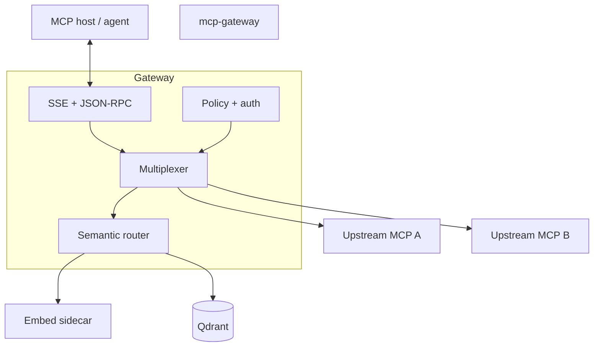

# Architecture documentation

How the MCP Gateway is designed and which documents to read.

- [package-layers.md](package-layers.md) — what depends on what, and one request end to end. Both generated from the code.
- [mcp_gateway.plan.md](mcp_gateway.plan.md) — the full technical specification.
- [../adr/](../adr/README.md) — one decision per record.

The diagram below is deployment topology. For code layers, read `package-layers.md`.

---

## Start here

| Layer | Responsibility |
|-------|----------------|
| **Host transport** | `GET /mcp/sse` + `POST /mcp/rpc`, session id, SSE push of JSON-RPC results |
| **Multiplexer** | Merge `initialize` / list RPCs; forward `tools/call` with `prefix__` stripping |
| **Semantic router** | Resolve ambiguous `tools/call` (exact → rules → vectors + optional BM25) |
| **Security** | JWT, RAR merge, JSON Schema on tools, rate limits |
| **Observability** | OTel traces/metrics, phase histograms, audit sink |

Operator-oriented summary: [DEVELOPER.md, Architecture section](../DEVELOPER.md#architecture).

---

## Documents

| Document | When to read |
|----------|--------------|
| [ADR 0001](../adr/0001-architecture-decisions.md) | Why SSE and local embeddings + Qdrant |
| [ADR 0002](../adr/0002-filter-list-mode.md) | `filter_list` router mode |
| [ADR 0003](../adr/0003-security-rar-jwt-merge-failmode.md) | JWT ∩ RAR, fail-closed policy |
| [ADR 0004](../adr/0004-gateway-scope.md) | Supported MCP methods and boundaries |
| [mcp_gateway.plan.md](mcp_gateway.plan.md) | Full specification (requirements, flows, acceptance criteria) |

### Plan vs ADRs

| Document | Role |
|----------|------|
| **ADRs** ([0001](../adr/0001-architecture-decisions.md)–[0004](../adr/0004-gateway-scope.md)) | Accepted decisions: stack, `filter_list`, JWT/RAR merge, supported MCP scope |
| **`mcp_gateway.plan.md`** | Full specification (requirements, flows, implementation decision register) |

When prose differs, **the ADR for that topic wins** (for example AuthZ scope in ADR 0004, `filter_list` semantics in ADR 0002). **Residual** rows in the plan are operator tuning, not open repo work; implemented behavior is defined by code + ADRs + [OpenAPI](../artifacts/openapi/openapi.yaml).

---

## Code layout (orientation)

| Package | Role |
|---------|------|
| `internal/gateway/httpserver` | HTTP ingress |
| `internal/gateway/session` | Per-SSE session state |
| `internal/gateway/multiplex` | Upstream merge and forward |
| `internal/router` | Semantic routing and catalog index |
| `internal/auth`, `internal/policy` | Authentication and authorization |
| `internal/upstream/mcphttp`, `mcpstdio` | Upstream clients |
| `internal/telemetry` | OTel, metrics, structured logs |

---

## Related

- [mcp-capabilities.md](../mcp-capabilities.md): method matrix for hosts
- [configuration.md](../configuration.md): tunables
- [OpenAPI](../artifacts/openapi/openapi.yaml): HTTP contract
- [Evaluation](../evaluation/README.md) · [calibration results](../evaluation/calibration-results.md): recorded lab evidence
