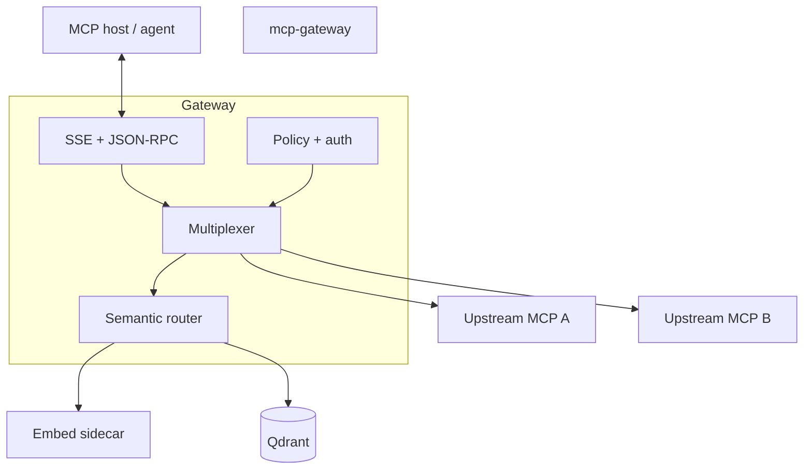

# Architecture documentation

How the MCP Gateway is designed and which documents to read.

---

## Start here

| Layer | Responsibility |
|-------|----------------|
| **Host transport** | `GET /mcp/sse` + `POST /mcp/rpc`, session id, SSE push of JSON-RPC results |
| **Multiplexer** | Merge `initialize` / list RPCs; forward `tools/call` with `prefix__` stripping |
| **Semantic router** | Resolve ambiguous `tools/call` (exact → rules → vectors + optional BM25) |
| **Security** | JWT, RAR merge, JSON Schema on tools, rate limits |
| **Observability** | OTel traces/metrics, phase histograms, audit sink |

Operator-oriented summary: [DEVELOPER.md § Architecture](../DEVELOPER.md#architecture).

---

## Documents

| Document | When to read |
|----------|--------------|
| [ADR 0001](../adr/0001-architecture-decisions.md) | Why SSE and local embeddings + Qdrant |
| [ADR 0002](../adr/0002-filter-list-mode.md) | `filter_list` router mode |
| [ADR 0003](../adr/0003-security-rar-jwt-merge-failmode.md) | JWT ∩ RAR, fail-closed policy |
| [ADR 0004](../adr/0004-gateway-scope.md) | Supported MCP methods and boundaries |
| [mcp_gateway.plan.md](mcp_gateway.plan.md) | Full specification (requirements, flows, acceptance criteria) |

---

## Code layout (orientation)

| Package | Role |
|---------|------|
| `internal/gateway/httpserver` | HTTP ingress |
| `internal/gateway/session` | Per-SSE session state |
| `internal/gateway/multiplex` | Backend merge and forward |
| `internal/router` | Semantic routing and catalog index |
| `internal/auth`, `internal/policy` | Authentication and authorization |
| `internal/backend/mcphttp`, `mcpstdio` | Upstream clients |
| `internal/telemetry` | OTel, metrics, structured logs |

---

## Related

- [mcp-capabilities.md](../mcp-capabilities.md): method matrix for hosts
- [configuration.md](../configuration.md): tunables
- [OpenAPI](../artifacts/openapi/openapi.yaml): HTTP contract
