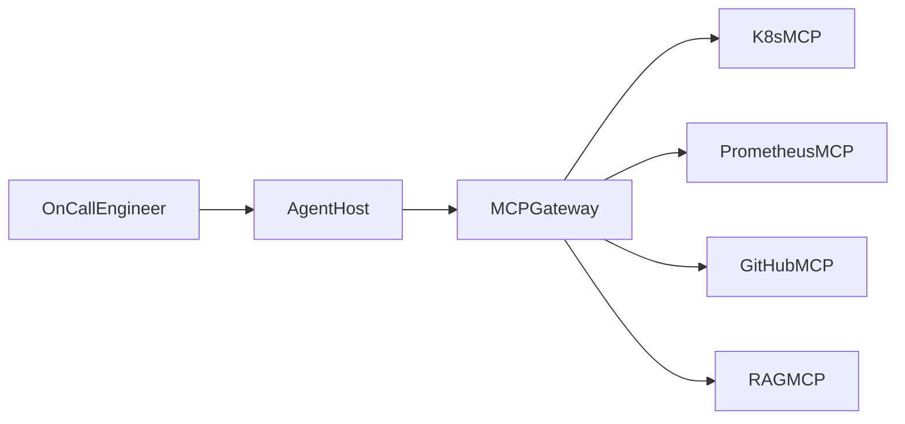
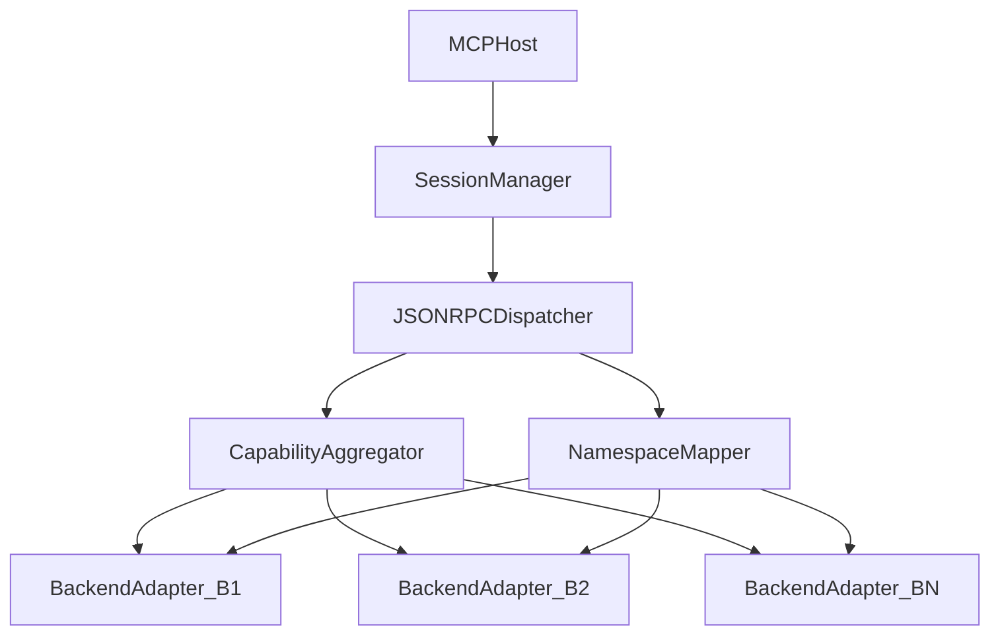
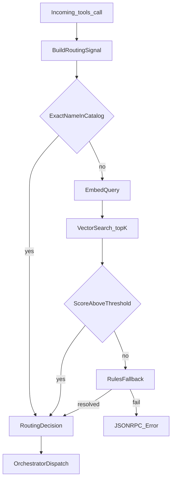
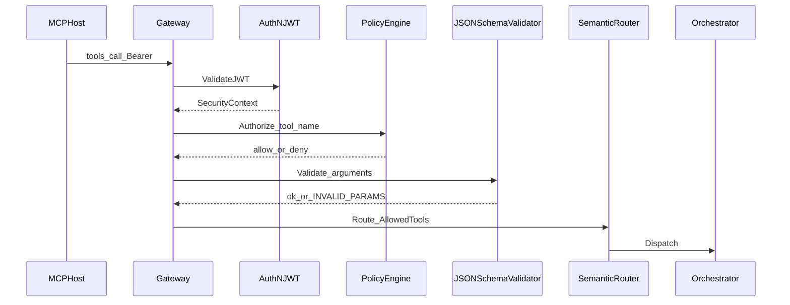
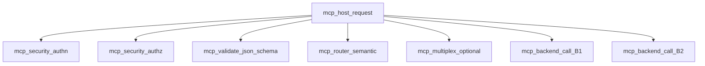
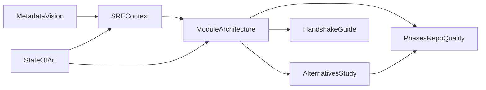

# Technical specification: MCP gateway for platform engineering

## Role of this document (read first)

- **Canonical document:** This file under `docs/architecture/` is the **in-repo architecture specification** for the MCP Gateway.
- **Standalone export:** When you need Markdown without Cursor metadata, **export** the body (from the first numbered section through bibliography), removing the YAML block at the top.
- **Audience:** Technical reviewers, Go engineering, and AI agents implementing from explicit contracts.

---

## Objective and scope

- **Target length:** ~15 pages of substantive content (on the order of 6,000, 9,000 words excluding diagrams), formal technical prose where a longer narrative exists outside this repo; this plan is in **English** for the repo, **navigable outline**, numbered sections, **requirement → module traceability**.
- **Core topic:** Intermediation infrastructure that reduces the host↔server **mesh** (N×M) via a **centralized Go orchestrator** that does not replace MCP but multiplexes it, enforces policy, and adds observability.

---

## 1. Project metadata and vision

Fixed block (also in exported `mcp_gateway.md` if you split it):


| Field  | Value                                                  |
| ------- | -------------------------------------------------------------------------------------------------------- |
| Title  | Design and implementation of a Model Context Protocol (MCP) gateway for platform engineering       |
| Author | Carlos Palomero                                             |
| Version | 1.0 (engineering draft)                                         |
| Date  | *(update each revision)*                                         |


- **In scope:** Go gateway as the single MCP negotiation point toward N upstream servers; capability aggregation with mandatory **namespacing**; cross-cutting security and telemetry.
- **Out of scope:** **Frontend** is not part of this gateway (priority: backend, AI integration, operational case). Any minimal UI for demos is explicitly non-core.
- **Guidance paragraph for AI/engineering:** Define in prose: prefix convention (`k8s__…`, `prom__…`), what counts as internal gateway **hop** vs backend latency, and what **transparent routing** means (the host only talks to the gateway).

---

## 2. Business context: SRE and platform engineering

**Use case, incident response:**


| Element             | Content to develop in prose                                                                      |
| ------------------------------- | ------------------------------------------------------------------------------------------------------------------------------------------------------------------- |
| Actors             | On-call engineer; agent (e.g. **LangGraph**) as reasoning orchestrator                                               |
| Silos integrated via MCP    | **Kubernetes** (infra/state), **Prometheus** (metrics), **GitHub** (versions/PRs/releases), **RAG** over runbooks/documentation                    |
| Problem             | Connection mesh, fragmented credentials and policies, redundant or conflicting tool catalogs                                     |
| Value, MTTR          | Explicit causal chain: less context switching, unified tool discovery, correlated traces; **do not invent figures**, room for experimental benchmark results       |
| Value, corporate security   | Centralized identity (OIDC), least privilege per tool, granular consent, input validation (link to §3.C)                               |
| Stakeholder note        | Explicit subsection: **absolute priority** to backend, AI, and business case; **frontend out of scope**                                |


**Mermaid diagram (required), business context:**




*(In the expanded version: add a policy/telemetry legend on nodes or a note below the diagram.)*

---

## 3. System architecture (specifications for implementation / AI)

For **each** subsystem **A, D**, the final document should complete four subsections:

1. **Responsibility**
2. **Interface contract** (MCP messages, SSE, errors)
3. **Data flow** (steps or diagram)
4. **Golden rules**

### A. Multiplexing orchestrator: P0 (critical)

Expanded implementation specification. This component is the **gateway core**: all MCP traffic from the host passes through it; it multiplexes N logical connections to upstream MCP servers and returns a **single** coherent protocol view to the host.

#### A.1 Responsibility

**Includes:**

- Accept connections from the **MCP host** (gateway client) according to the chosen remote MCP transport (in this design: HTTP + **Server-Sent Events** for the message session).
- Maintain the host **session lifecycle**: from the first `initialize` until stream close or administrative timeout.
- Translate each incoming host **JSON-RPC 2.0** message into one or more backend operations: forward, merge (via the multiplexer), or controlled fan-out per MCP method.
- Apply **stable namespacing** on tool names (and, when the design extends to resources/prompts) so the host never sees collisions between two distinct servers.
- Correlate **JSON-RPC identifiers** (request/response `id` and, if applicable, internal sub-ids) end-to-end host ↔ gateway ↔ backend so notifications and responses do not mix across clients or backends.
- Manage **concurrency** with goroutines and `context.Context`: cascade cancellation when the host closes the connection or when a backend fails in a way that should abort the in-flight request (policy configurable per method).
- Expose **hooks** for later middleware (security §3.C, semantic router §3.B, telemetry §3.D) without coupling the multiplexer to embedding logic or OIDC in Phase 1: the orchestrator defines **extension points** (Go interfaces) on the request path.

**Explicitly excludes (other modules):**

- Deciding *which* tool is semantically best for a natural-language intent (that is §3.B); the multiplexer may run in “dispatch by already-resolved name” mode or delegate to the router when enabled.
- Authenticating the end user or evaluating RAR/JWT (§3.C), except a Phase 1 stub that does not change the message contract.
- Exporting OTel traces (§3.D), though it should emit minimal **structured events** (e.g. logs with `request_id`, `jsonrpc_id`, `backend_id`) for later instrumentation.

#### A.2 Interface contract

**Toward the host (gateway public surface):**

- The host uses the same conceptual contract as with a standard MCP server: MCP messages wrapped in JSON-RPC 2.0.
- **Requests** from host to gateway: typically HTTP POST (JSON body with the JSON-RPC object or the envelope defined by MCP HTTP transport). The gateway must **validate** a minimal schema: presence of `jsonrpc`, `method`, and `id` or consistent absence for a notification per JSON-RPC 2.0.
- **Responses / server-initiated:** the gateway pushes **SSE** events (`text/event-stream`). Each event must carry a payload the host can parse as an MCP message (response to `id`, or server notification). Correlation requires preserving JSON-RPC `id` in the implementation except for documented aggregations (e.g. a single synthetic response after fan-in).
- **MCP methods** the orchestrator should treat as **first-class** in the implementation handbook: at least `initialize`, `initialized` (notification), `tools/list`, `tools/call`, and those needed for the PoC (`ping` if present in the spec version used, `resources/*` if added in later phases). For each, internal docs should state: gateway-only, backend-only, or aggregation?

**Toward each backend (internal surface):**

- Each backend is modeled as an **adapter** behind a common interface, e.g. `BackendSession` with `Call(ctx, jsonrpcRequest) (jsonrpcResponse | stream, error)` or equivalent, whether the real server uses stdio, HTTP+SSE, or else.
- The orchestrator must **not** expose prefixed tool names to the backend: on `tools/call` it must **strip** the agreed prefix and send the native name that server expects, unless the backend is explicitly configured to accept prefixed names (not recommended).
- **Errors:** propagate JSON-RPC 2.0 `error` with stable codes. Define a subset of gateway application codes (e.g. backend unavailable, timeout, unresolved name collision) in an internal table so hosts and tests can assert behavior.

**Minimal configuration shapes (implementation reference):**

- Ordered backend list: stable `id` (string), URL or command, credentials by reference (secret/K8s secret), **namespace prefix** (e.g. `k8s`, `prom`).
- **Separator** rules between prefix and native name: default double underscore `__` (e.g. `k8s__get_logs` → prefix `k8s`, native `get_logs`). If a native name contains the separator, policy must be defined (escape, reject, or explicit mapping table).

#### A.3 Data flow

**Host ↔ gateway session:**

1. The host opens the streaming side of the transport (GET SSE or whatever the MCP spec in use requires) and optionally sends the first POST for `initialize`.
2. The gateway **SessionManager** assigns an internal `session_id` (UUID) and registers a write channel to the host SSE.
3. Each incoming JSON-RPC message is enqueued in a **dispatcher** that:
 - validates JSON-RPC syntax;
 - classifies `method` (standard MCP vs notification);
 - invokes the corresponding **method handler**.

**`initialize` (orchestrator view):**

- The handler does not answer from memory alone: it runs **synthetic negotiation** (expanded in §5): query each backend (sequential or concurrent with a concurrency cap), collect `capabilities` and protocol versions, and **merge** into a single `InitializeResult` to the host, recording in internal metadata which capability subset comes from which backend (for traceability and for the router).
- If a backend does not respond, default policy: **omit** that backend from the catalog and log a warning; if all fail, return a JSON-RPC error to the host.

**`tools/list`:**

- The gateway may cache the merged tool catalog with TTL or invalidate on backend reconnect.
- Flow: for each connected backend, obtain native `tools/list`, **prefix** each `name`, merge lists, dedupe by fully prefixed name; full-name conflicts after prefix are impossible if configured prefixes are unique (golden rule).

**`tools/call`:**

1. Parse the tool name requested by the host.
2. **Resolve** prefix → target backend (configuration table or, with §3.B enabled, router decision returning the same logical target).
3. **Transform** the request body: strip name to native; arguments unchanged except §3.C validation.
4. Forward to the backend with the same JSON-RPC `id` **or** map `id` if the design uses internal ids; if mapped, keep a `host_id → backend_id` table until the response arrives and rewrite to the host with the host’s original `id` (recommended for transparency).
5. Return the backend response on the host SSE stream. If the backend returns partial errors or structured MCP content (`content`, `isError`), forward without changing semantics except redaction policies (future).

**Concurrency:**

- Multiple concurrent host `tools/call`s must be able to run in parallel against different backends; use **limits** (per-backend or global semaphore) to avoid saturating downstream services.
- A single host session should serialize or not SSE writes per MCP client guarantees: in general, **serializing writes** to the SSE `ResponseWriter` with a per-session mutex avoids interleaved corrupt frames.

#### A.4 Golden rules


| Rule                           | Rationale                                                             |
| --------------------------------------------------------- | --------------------------------------------------------------------------------------------------------------------------------- |
| **R1: Unique prefix per backend**            | Avoids collisions in `tools/list` and ambiguity in `tools/call`.                                 |
| **R2: Mandatory strip on forward**            | Backends see native contracts; only the gateway knows the prefix.                                |
| **R3: Preserve host-visible `id` in the response**     | The host JSON-RPC client must correlate without knowing internal ids.                               |
| **R4: One coherent SSE stream per host session**     | Avoids races and simplifies the client mental model.                                       |
| **R5: `context` with per-backend-call deadline**     | Hung backends must not block goroutines indefinitely; deadlines aligned with SLAs in §6.                    |
| **R6: Partial aggregation failure must not kill session** | One down backend does not invalidate others’ `initialize` unless an explicit “strict” policy.                  |
| **R7: Do not reinterpret MCP results**          | The gateway is a broker, not a second LLM; do not alter tool output text except agreed security policies (§3.C).         |


#### A.5 Component diagram (Mermaid)




#### A.6 Suggested Go packages (implementation)


| Package           | Intended contents                        |
| ---------------------------- | ---------------------------------------------------------------- |
| `internal/gateway/session`  | Host sessions, `id` map registry, serialized SSE writes, method dispatch |
| `internal/gateway/multiplex` | `initialize` / `tools/list` merge, cache invalidation      |
| `internal/gateway/namespace` | Prefix/strip, character validation and uniqueness        |
| `internal/backend`      | `Backend`, `Connect` interfaces, timeouts, health        |
| `internal/rpc`        | JSON-RPC 2.0 parse/validate (mandatory unit tests §6)      |


#### A.7 Orchestrator-specific acceptance criteria (Phase 1)

- Complete `initialize` handshake to the host with at least **two** mock backends and a namespaced merged catalog.
- `tools/list` returns a stable ordered union (convention: order by configured prefix, then native name).
- `tools/call` for tool `pref__tool` hits only the correct backend and the mock receives name `tool`.
- Unit tests for **prefix/strip mapping** and **preserved `id`** in responses.
- Document the exact SSE format used (event name, JSON data) in exported comments or `docs/DEVELOPER.md` / OpenAPI.

### B. Semantic router: P1 (high)

The **semantic router** reduces **context noise** for the agent when the merged tool catalog is large (multiple silos × dozens of tools). It does not replace the orchestrator: it **filters, disambiguates, and chooses destination** before the multiplexer performs prefix `strip` and backend forward per §3.A. It runs **inside** the gateway; the MCP host still has a single endpoint and a single merged `tools/list`, except optional modes documented below.

#### B.1 Responsibility

**Includes:**

- Build and maintain a **semantic index** of the **already namespaced** tool catalog (output of §3.A) from text derived per tool: `name`, `description`, parameter summary (names and types from JSON Schema if present), and optional metadata (`tags`, `owner_silo` from configuration).
- Run the **Signal → Decision** pipeline at each agreed routing point (minimum: `tools/call` path; optional: `tools/list` with a “filtered view” by session or policy header).
- Produce a stable **routing decision**: `(backend_id, tool_name_namespaced)` or internal equivalent the orchestrator maps to native name + adapter.
- **Operational transparency** toward the host: visible JSON-RPC does not expose the vector DB or embedding model; only valid MCP results or standard errors.
- Log **minimal audit** per decision: signal used, top-K candidates, scores, router latency, fallback use (for §3.D and evaluation).
- Allow **disabling** the module (feature flag): when the router is off, the multiplexer uses deterministic prefix resolution only as in Phase 1.

**Excludes:**

- Generating natural-language answers for the end user (that is the upstream agent LLM).
- Fine-grained authentication and authorization (§3.C); the router may receive already-resolved *constraints* (“only tools allowed for this JWT”) as policy input but does not validate tokens.
- Training custom models; assume an **embedding API** or bounded embedded library (decision §4).

#### B.2 Interface contract

**Indicative internal (Go) interface:**

```text
type RoutingSignal struct {
 SessionID    string
 Method     string      // e.g. "tools/call"
 ToolName    string      // name requested by host (may be empty in advanced modes)
 ArgumentsJSON  json.RawMessage  // MCP arguments
 IntentText   string      // optional: free text or last user message if host forwards it
 AllowedTools  []string     // optional: subset imposed by §3.C
 CatalogVersion string      // hash of merged tools/list to invalidate index cache
}

type RoutingDecision struct {
 UpstreamID     string
 ToolNameNamespaced string
 Confidence     float64    // 0..1 or normalized score
 Candidates     []ScoredTool // top-K for logs / explainability
 FallbackLayer    string    // "exact" | "vector" | "rules" | "default_backend"
 LatencyMS      int64
}

type ScoredTool struct {
 Name  string
 Score float64
 Source string // e.g. "vector", "bm25", "hybrid"
}
```

**Signal input:**


| Signal source           | Use                                                                                              |
| ---------------------------------- | --------------------------------------------------------------------------------------------------------------------------------------------------------------------------------------------- |
| `tools/call`: `name` + `arguments` | Primary in standard MCP: vector compares the request to tool descriptions.                                                          |
| Optional `IntentText`       | If the host or an agent proxy sends context (agreed HTTP header, experimental param field, or documented convention), improves recall when `name` is generic or an alias.       |
| Short session history       | Optional Phase 2+: last N invoked tool names to disambiguate semantic collisions (implementation: buffer in `SessionManager`, not required for minimum milestone).               |


**Output (Decision):**

- Must be **consumable by the orchestrator** with no extra logic except prefix strip and dispatch.
- If the decision is “reject” (low confidence and no fallback): return to the host an application JSON-RPC error with a stable message (e.g. internal `code` `TOOL_ROUTING_AMBIGUOUS` documented in the gateway error table).

**Vector DB contract:**

- **Implementation decision:** **Qdrant** as reference vector store (see §4.1 for rationale and alternatives). The internal interface (`internal/router/store`) must remain **abstractable** for tests with doubles/fakes without a container.
- Minimum operations: `Upsert(vectors + metadata)`, `Query(vector, topK, filter)`, `DeleteByCatalogVersion` or full rebuild on catalog change, all mappable to Qdrant collections/points API and **payload** filters (`backend_id`, `tool_name_namespaced`, `catalog_version`, etc.).
- **Filters**: by `AllowedTools`, `backend_id`, tags, must be applied **before** the final top-K to enforce policy without *post hoc* in-memory filtering only (avoids leaking forbidden names in ranking logs).

**Operating modes (configurable):**


| Mode     | Behavior                                                                                  |
| ------------- | --------------------------------------------------------------------------------------------------------------------------------------------------------------------------- |
| `off`     | No embeddings; exact `name` match + rule/alias table only.                                                          |
| `assist_list` | `tools/list` to host stays full; router only affects `tools/call` or an internal “suggestions” endpoint (if exposed).                            |
| `filter_list` | `tools/list` returns a subset filtered by similarity to session `IntentText` (requires defining how session intent is set; document the mechanism in this repo).     |


#### B.3 Data flow: Signal, Decision pipeline

**Phase 1, Catalog ingestion (trigger: change in §3.A aggregation):**

1. When a new merged `tools/list` completes (or on a refresh interval), **CatalogIndexer** serializes each tool into a normalized **text document** (fixed template: name, description, parameters, silo).
2. Compute **embedding** per document (batch) and write to the Vector DB with metadata: `tool_name_namespaced`, `backend_id`, `catalog_version`.
3. Invalidate L1 in-memory cache queries tied to the previous `catalog_version`.

**Phase 2, Intent classification (per request):**

1. **Build query text** for request embedding: controlled concatenation of `ToolName`, summary of `arguments` keys, and `IntentText` if present (fixed order and separators for reproducibility).
2. **Light classifier (optional):** rules or small model labeling the request as `EXACT_NAME`, `AMBIGUOUS`, or `EXPLORATION` (no clear name). This label **only** adjusts weight of the next step; it does not replace the vector.
3. If the label is `EXACT_NAME` and `ToolName` exists literally in the catalog and is in `AllowedTools` → **deterministic shortcut**: immediate decision without vector query (minimum latency).

**Phase 3, Vector search and candidate reduction:**

1. Embed the query; `Query` with configurable `topK` (e.g. 8, 24) and policy filters.
2. **Score threshold** `T_min`: below it, do not auto-accept top-1 unless there is a **single** candidate after filtering.
3. **Optional hybrid:** combine BM25 over names/descriptions in memory or a secondary engine with vector score (weights α, β documented for reproducibility).
4. **Semantic deduplication:** if two very similar tools from the same backend appear in top-K, apply tie-break (higher score, or configured silo preference).

**Phase 4, Decision and transparent routing:**

1. Choose winning `ToolNameNamespaced` and map to `backend_id`.
2. Pass the decision to the **multiplexer** to run `tools/call` as if the host had named that tool directly (controlled substitution of `name` **only if** configuration allows automatic name correction; otherwise reject with error to avoid surprising the client, configurable **`AllowAutoRename`**).
3. Record `RoutingDecision` on the session span/log.

**Temporal interaction with §3.A (recommended strict order):**

```text
Incoming JSON-RPC → syntax validation → §3.C (when present) → §3.B router → §3.A dispatch to backend
```

#### B.4 Golden rules


| Rule                                       | Rationale                                                               |
| --------------------------------------------------------------------------------- | ------------------------------------------------------------------------------------------------------------------------------------- |
| **S1: Never in-memory-only filter what policy must filter in the index**     | Avoids ranking and logs over forbidden tools.                                             |
| **S2: Versioned catalog**                            | Reproducibility and consistency between host-visible `tools/list` and served vectors.                         |
| **S3: Deterministic shortcut before vector**                   | Gateway p95 latency: happy path with explicit name does not pay embedding cost.                            |
| **S4: Explicit `AllowAutoRename`, conservative default**             | Transparency: host may assume requested name is executed unless clearly configured otherwise.                      |
| **S5: Top-K and thresholds in config, not hardcoded**              | Experimental tuning for evaluation without recompiling.                                     |
| **S6: Graceful degradation**                           | If the Vector DB is unavailable, fall back to rules + exact match and alert; do not kill the session unless strict policy.      |
| **S7: Minimal explainability**                          | Keep candidates and scores in structured logs (retention per privacy).                                |


#### B.5 Flow diagram (Mermaid)




#### B.6 Suggested Go packages (implementation)


| Package         | Intended contents                                   |
| ----------------------- | ------------------------------------------------------------------------------------- |
| `internal/router`    | Signal, Decision pipeline orchestration, mode flags                  |
| `internal/router/index` | CatalogIndexer, text normalization, `catalog_version`                 |
| `internal/router/embed` | Embedding client, cache by text hash                         |
| `internal/router/store` | **Qdrant** implementation (official HTTP/gRPC or Go client); mock in unit tests    |
| `internal/router/rules` | Aliases, keywords, silo→prefix maps                          |


#### B.7 Observability and router-specific metrics (alignment §3.D)

- Histogram: router latency by layer (`exact`, `vector`, `fallback`).
- Counter: `router_decisions_total{layer,outcome}`.
- Optional gauge: index size and active `catalog_version`.

#### B.8 Router-specific acceptance criteria (Phase 2)

- With a catalog of ≥20 synthetic tools, show that vector query shrinks the candidate set while respecting `AllowedTools`.
- Integration test: ambiguous name resolved by vector to the correct tool with documented score; no valid candidate returns a stable error.
- Reproducible benchmark: p95 of vector + embedding phase under the budget agreed in §6 (excluding MCP backend latency).
- Document default `topK`, `T_min`, `AllowAutoRename`, and the exact indexed document format in the repo.

**In-repo harness:** `internal/router/eval`, synthetic catalog (`SyntheticCatalog`, 24 tools), golden intents, `TestPhase2VectorRecallLexical` (recall@1), `TestPhase2EmbedAndQueryP95`, and silo narrowing coverage. Run: `go test ./internal/router/eval -run Phase2 -v`. The lexical embedder is deterministic (no live ONNX); repeat the same tests against **all-MiniLM-L6-v2** + Qdrant for thesis-grade numbers.

### C. Security layer: P1 (high)

The security layer implements **authentication**, **per-tool authorization**, and **input validation** before a request reaches the semantic router (§3.B) and multiplexer (§3.A). Goal: reduce abuse surface (injection, lateral escalation via dangerous tools, exfiltration via malformed arguments) and align the gateway with **Zero Trust** practice (explicit identity, least privilege, logged decisions).

#### C.1 Responsibility

**Includes:**

- **Authentication (AuthN)** of the gateway client: validate credential presentation on the HTTP transport carrying MCP (e.g. `Authorization: Bearer <JWT>` header or client mTLS in corporate deployments). Resolve **subject identity** (`sub`), **issuer** (`iss`), **audience** (`aud`), validity, and if applicable **tenancy** (org, cluster) via agreed claims.
- **Authorization (AuthZ)** at **namespaced MCP tool** level (`prom__query_range`, `k8s__get_logs`, …): decide whether the subject may **invoke** that specific tool, not only whether they can “talk to the gateway”.
- **Granular consent** modeled with **Rich Authorization Requests (RAR)** or another documented equivalent: the token or authorization session must reflect **which tools** (or logical tool groups) were accepted by the user or corporate policy, avoiding one broad scope enabling the whole merged catalog.
- **Argument validation** for `tools/call` against per-tool **JSON Schema** **before** forwarding to the backend (golden rule reinforced in C.4): types, ranges, patterns, `required`, `additionalProperties: false` where appropriate.
- **Security audit**: structured logging of denials, requested tool, policy version, `sub` (hashed or truncated for privacy), without dumping sensitive arguments in clear except explicit debug policy.
- **Supply to §3.B** the `AllowedTools` subset derived from effective policy after AuthZ so vector search **never** promotes forbidden tools.

**Excludes:**

- Managing human identities in the IdP (user signup, login UI); the gateway **consumes** third-party-issued tokens.
- Encrypting Vector DB data at rest (deployment responsibility §6); gateway must not persist secrets in logs.
- Replacing Kubernetes network policy or cloud IAM; the gateway is an **application policy enforcement point** for MCP, not a replacement for L3/L4 firewalls.

#### C.2 Interface contract

**Surface toward host / HTTP client:**


| Mechanism                      | Use                                                                     |
| ---------------------------------------------------- | -------------------------------------------------------------------------------------------------------------------------------------------- |
| `Authorization: Bearer <JWT>`           | Default documented mode for this gateway; MCP host or agent proxy attaches the token on each POST/stream tied to the session.        |
| mTLS (optional)                   | Workload identity (service cert) complementing or replacing Bearer in mesh environments; map cert → `SPIFFE ID` → policy.           |
| Context headers (optional, project convention)    | E.g. `X-Tenant-ID` only if signed or bound to JWT; do not trust unauthenticated headers for critical decisions.               |


**Claims and policy (guidance, not normative for external summaries):**

- Minimum claims to validate: `iss`, `aud`, `exp`, `nbf`/`iat`, `sub`.
- Suggested authorization claims: allowed tool list (`mcp_tools: ["k8s__get_logs", …]`) or groups (`mcp_tool_groups: ["k8s_read"]`) resolved to tools in the gateway via a versioned **configuration table**.
- **RAR:** when the OAuth/OIDC flow uses `authorization_details` (RFC 9396), the gateway must interpret an agreed detail type, e.g. `type: "mcp_tool"` with `tool_name` or `tool_pattern` (glob). Implementation must document the exact accepted **JSON** and mapping to namespaced names.

**Internal contract toward §3.B and §3.A:**

```text
type SecurityContext struct {
 SubjectID   string      // sub or SPIFFE
 TenantID   string      // optional
 AllowedTools map[string]struct{} // closed set after evaluation
 PolicyVersion string
 RawClaims   jwt.MapClaims   // only if needed; avoid logging full claims
}

// After AuthN/AuthZ + schema validation:
func Enforce(req *JSONRPCRequest, ctx *SecurityContext) error
```

**Errors toward the host (JSON-RPC 2.0):**


| Situation                     | Recommended behavior                                            |
| ------------------------------------------------- | ---------------------------------------------------------------------------------------------------------- |
| Missing or malformed token            | `-32001` or documented application code `UNAUTHENTICATED`                        |
| Valid token but no consent for the tool      | `PERMISSION_DENIED` (do not reveal other tools if security-through-obscurity policy)            |
| Arguments fail JSON Schema validation       | `INVALID_PARAMS` (JSON-RPC) with minimal `message` detail (avoid leaking internal schema in production)  |
| Policy not loaded / internal error        | `-32603` with `request_id` correlation for support                             |


#### C.3 Data flow

**Pipeline order (consistent with §3.B):**

```text
Parsed JSON-RPC → C.AuthN → C.AuthZ per method/tool → C.JSONSchema(args) → B.Router (receives AllowedTools) → A.Multiplexer
```

**By MCP method type:**


| Method     | Security actions                                                                          |
| -------------- | ------------------------------------------------------------------------------------------------------------------------------------------------------------------ |
| `initialize`  | Client AuthN; optionally restrict `clientInfo` or versions; do not expose sensitive backend capabilities in the merged result if policy forbids.         |
| `tools/list`  | Filter the merged list **before** sending to the host: only tools ∈ `AllowedTools` (reduces surface metadata leakage).                     |
| `tools/call`  | AuthZ by tool name; JSON Schema validation; optionally `arguments` size limits (bytes and JSON depth) before schema.                       |
| Notifications | Define whether they require the same Bearer; default **yes** on the same HTTP/SSE session.                                     |


**RAR / consent flow (logical view):**

1. On **first** session contact, the gateway may require the JWT to include already-granted `authorization_details` or claims derived from a **prior** IdP step (out of scope: consent screens).
2. **PolicyEngine** expands RAR details to sets of namespaced `tool_name` (glob resolution, groups).
3. Each `tools/call` checks membership in the set; short denial without calling the backend.

**JSON Schema flow:**

1. During **catalog ingestion** (with §3.A / merged `tools/list`), attach an optional per-tool **input schema**: from static config, backend metadata if exposed, or default “free object” only in dev (must be explicit).
2. On `tools/call`, after AuthZ, run a validator for the chosen **JSON Schema draft** (e.g. 2020-12); reject on failure.
3. **Performance:** cache compiled schemas by `tool_name` + `schema_version`.

#### C.4 Golden rules


| Rule                                    | Rationale                                                              |
| --------------------------------------------------------------------------- | ------------------------------------------------------------------------------------------------------------------------------------ |
| **SEC1, Validate JWT before any business logic**              | Avoids useful work for anonymous attackers and simplifies rate limiting.                               |
| **SEC2, Filtered `tools/list` = policy, not UI only**           | Host must not see tools it cannot invoke (less enumeration, less agent confusion).                          |
| **SEC3, JSON Schema mandatory for risky tools in prod**          | Configurable list of “elevated” tools that **require** strict schema; no schema → deny or `dev` only.                |
| **SEC4, `additionalProperties: false` by default in corporate schemas**  | Limits injection of unexpected fields toward backends that forward to APIs.                             |
| **SEC5, Do not log tokens or secret-bearing arguments**          | Redact `password`, `token`, `kubeconfig`, etc., via a key list.                                   |
| **SEC6, JWT keys (JWKS) with cache and rotation**             | Fetch JWKS from `iss`, cache TTL, handle unknown `kid`.                                       |
| **SEC7, Fail closed**                            | If PolicyEngine cannot evaluate (store down), **deny** unless explicit degradation mode documented for non-prod.           |


#### C.5 Sequence diagram (Mermaid)




#### C.6 Suggested Go packages (implementation)


| Package            | Intended contents                              |
| ------------------------------ | --------------------------------------------------------------------------- |
| `internal/auth/oidc`      | JWT validation, JWKS, claim extraction, optional mTLS            |
| `internal/auth/rar`      | `authorization_details` parser, expansion to tools             |
| `internal/policy`       | Rules engine, versioning, optional hot-reload from file/CRD         |
| `internal/validate`      | JSON Schema load/compile, `arguments` validation, JSON size limits     |
| `internal/middleware/security` | HTTP/MCP chaining before JSON-RPC handler                  |


Common Go ecosystem libraries (implementation reference, not prescriptive): `github.com/golang-jwt/jwt`, JSON Schema validators (e.g. `sanathkr/go-jsonschema` or `xeipuuv/gojsonschema`, evaluate license and draft in §4).

#### C.7 Stub mode (Phases 1, 2) vs production (Phase 3)


| Phase | Behavior                                                             |
| ----- | -------------------------------------------------------------------------------------------------------------------------------- |
| 1, 2  | `AUTH_MODE=none` or optional JWT without RAR: minimal syntax validation only; document **not** safe for public exposure.     |
| 3   | AuthN/AuthZ + Schema + audit on by default in `staging`/`prod`.                                 |


#### C.8 Specific acceptance criteria (Phase 3)

- Invalid JWT (signature, `exp`) → stable JSON-RPC response without calling backends.
- Tool not consented → `PERMISSION_DENIED` without forward; audit event emitted.
- `tools/list` for a test subject returns **only** the authorized subset against a larger merged catalog.
- Unit cases: 3+ schemas (valid, wrong type, extra field with `additionalProperties: false`) for an example tool.
- OpenAPI/Swagger or `docs/DEVELOPER.md`: required headers, expected claims, example RAR `authorization_details` for two tools.

### D. Observability engine: P2 (medium)

The **observability engine** provides correlated **distributed traces**, **metrics**, and **structured logs** to operate and evaluate the gateway in SRE-oriented scenarios (MTTR, incident acknowledgment, meeting the latency budget §6). It uses **OpenTelemetry (OTel)** as the single API/SDK and prefers export via **OTLP** to backends chosen in §4 (Jaeger, Tempo, Prometheus, Honeycomb, etc.).

#### D.1 Responsibility

**Includes:**

- Initialize the **OTel SDK** in the gateway process: `Resource` (service name, version, environment), trace **propagators** (`tracecontext`, `baggage` if agreed with the host), and configurable OTLP gRPC/HTTP **exporters**.
- Build a **span hierarchy** around useful work per incoming MCP request: one **root span** per work unit visible from the host (e.g. per processed JSON-RPC message or `session_id` + `jsonrpc.id` correlation, per chosen granularity; document in code to avoid duplicate roots).
- Nest **child spans** per internal phase: authentication/authorization (§3.C), semantic routing (§3.B), **each backend call** in `tools/call` or aggregation fan-out, JSON Schema validation, SSE serialization.
- Emit **metrics** for latency per **hop** (time inside gateway process vs waiting on backend), error counters by `method`, `backend_id`, and JSON-RPC code, and histograms aligned with **p95 < 50 ms** for the **internal hop** §6.
- Correlate application **logs** (slog/zap) with `trace_id` and `span_id` via the OTel Logs ↔ trace **bridge**.
- Expose **health and minimal telemetry** endpoints for Kubernetes (`/healthz`, `/readyz`) without conflating with OTel metrics (those go via OTLP exporter or **Prometheus scrape** of a collector sidecar if using the collector pattern).

**Excludes:**

- Sampling or storing **prompt** or LLM response content (happens outside the gateway except optional metadata).
- Replacing the **IdP** or corporate SIEM; the gateway **exports** signals, not final retention or alerts (see deployment docs).

#### D.2 Interface contract

**Service identity (OTel Resource):**


| Attribute        | Indicative value         |
| ------------------------ | -------------------------------- |
| `service.name`      | `mcp-gateway` (configurable)   |
| `service.version`    | Git or semver of the binary   |
| `deployment.environment` | `dev` / `staging` / `prod`    |


**Span naming conventions (mandatory in implementation):**


| Span                          | When created                         | Parent                                 |
| ------------------------------------------------------- | ------------------------------------------------------------- | ---------------------------------------------------------------------- |
| `mcp.host.request`                   | On accepting a host JSON-RPC message (after successful parse) | root (or child of HTTP transport span if server is instrumented)    |
| `mcp.security.authn`                  | JWT / mTLS validation                     | `mcp.host.request`                           |
| `mcp.security.authz`                  | Per-tool policy check                     | `mcp.host.request`                           |
| `mcp.validate.json_schema`               | Argument validation                      | `mcp.host.request`                           |
| `mcp.router.semantic`                  | Signal, Decision pipeline §3.B                 | `mcp.host.request`                           |
| `mcp.backend.call`                   | One invocation per participating backend           | `mcp.host.request`                           |
| `mcp.multiplex.initialize` / `mcp.multiplex.tools_list` | Multi-backend negotiation or merge               | `mcp.host.request`                           |


**Recommended standard attributes (OTel semantics + MCP domain):**

- `mcp.method` (string): JSON-RPC / MCP method, e.g. `tools/call`.
- `mcp.tool.name` (string): namespaced name after router.
- `mcp.backend.id` (string): configured backend identifier.
- `mcp.jsonrpc.id` (stringified): correlation with client.
- `mcp.session.id`: internal session UUID §3.A.
- `error.type` / `exception.message` on spans with `Error` status (no sensitive data).

**Context propagation in Go:**

- Use standard `context.Context`: each handler receives `ctx` with active `span`; child goroutines must use `trace.ContextWithSpan` or OTel Go’s recommended pattern so the **parent is not lost**.
- Outgoing HTTP calls to MCP backends (if HTTP) should inject `traceparent` via `otelhttp.NewTransport` or equivalent for trace continuity **where the backend accepts it** (many MCP servers ignore propagation; `mcp.backend.call` may remain a child of the gateway only, which is acceptable).

**Metrics, minimum instrumentation required for production observability:**


| Metric                   | Type   | Labels         | Definition                                                           |
| ------------------------------------------- | --------- | ----------------------- | ------------------------------------------------------------------------------------------------------------------------------ |
| `mcp_gateway_request_duration_seconds`   | Histogram | `method`, `outcome`   | Total handling time from ingress to response on the stream (includes backends).                       |
| `mcp_gateway_internal_duration_seconds`   | Histogram | `method`, `phase`    | Time **only** in gateway process per phase (`parse`, `security`, `router`, `mux`), basis for < 50 ms p95 budget §6. (OTel instrument: `mcp.gateway.internal.duration_seconds`.)      |
| `mcp_gateway_backend_call_duration_seconds` | Histogram | `backend_id`, `outcome` | Time from send to adapter until backend response.                                       |
| `mcp_gateway_requests_total`        | Counter  | `method`, `outcome`   | Request count (`success` / `client_error` / `server_error`).                                  |


**Token usage:**

- The gateway does **not** observe LLM token usage by itself. Documented options to pair with upstream telemetry:
 - **Optional metadata:** agreed HTTP header, e.g. `X-Agent-Tokens-Used: 1234`, read in the handler and recorded as span attribute `mcp.agent.tokens_used` on `mcp.host.request` **if** the host sends it with a valid non-negative integer.
 - **No header:** omit token metadata (instrumentation quality trade-off).

#### D.3 Data flow

1. **Startup:** configure `TracerProvider` and `MeterProvider` with `resource.New()` and OTLP exporters; register graceful shutdown (`Shutdown` with timeout) on process signal.
2. **HTTP/SSE ingress:** middleware creates or continues span (if host sends `traceparent`, use `Propagators.Extract` to **link** upstream agent traces when present).
3. **Per JSON-RPC message:** start `mcp.host.request`; nest §3.C, §3.B, §3.A spans per path; close with `SetStatus` OK or Error per JSON-RPC outcome.
4. **`tools/call` with backend:** create `mcp.backend.call` per target; record `backend_id`, duration, and adapter error.
5. **Export:** OTel default batch processor; tune `BatchTimeout` and `MaxExportBatchSize` to avoid extreme latency on the critical path (document trade-off in this spec).

#### D.4 Golden rules


| Rule                               | Rationale                                                     |
| ---------------------------------------------------------------- | ----------------------------------------------------------------------------------------------------------------- |
| **O1, One root span per processed JSON-RPC request**      | Avoids unreadable trees and double-counting in metrics.                              |
| **O2, Mark span error if host receives JSON-RPC `error`**     | Consistency across logs, traces, and client experience.                              |
| **O3, Do not put `arguments` values in span attributes**    | Privacy and size; optional hashes if correlation needed.                             |
| **O4, Measure `internal_duration` with a monotonic clock**    | Reproducible internal latency per §6.                                       |
| **O5, Bounded label cardinality**                | Do not use unbounded `tool_name` on Prometheus without limits; prefer aggregation or top-N at the collector.  |
| **O6, Ordered SDK shutdown**                  | Avoid span loss when restarting K8s pods.                                     |


#### D.5 Span hierarchy diagram (Mermaid)




#### D.6 Suggested Go packages (implementation)


| Package           | Intended contents                      |
| ---------------------------- | ----------------------------------------------------------- |
| `internal/telemetry`     | OTel bootstrap, OTLP config, shutdown           |
| `internal/telemetry/mcp`   | Span names, attributes, `StartSpan(ctx, name)` helpers   |
| `internal/telemetry/metrics` | Histogram/counter registration per §D.2          |


Typical dependencies: `go.opentelemetry.io/otel`, `go.opentelemetry.io/contrib/instrumentation/net/http/otelhttp`, OTLP exporters.

#### D.7 Integration with system requirements (§6)

- Show in report or dashboard that **p95** of `mcp_gateway_internal_duration_seconds` (aggregated by `phase` or sum excluding backend wait) meets the agreed threshold under test load.
- Include a sample screenshot or query (PromQL / Jaeger / Honeycomb) showing **host → gateway → backend** for a given `jsonrpc.id`.

#### D.8 Specific acceptance criteria (Phase 3)

- OTLP traces visible in the chosen backend with at least `mcp.host.request` and `mcp.backend.call` in a test `tools/call` flow.
- Exported metrics with the histogram/counter series defined in §D.2 (final names may follow OpenTelemetry conventions with a stable prefix in docs).
- Logs for a failed request include a `trace_id` queryable in the trace backend.
- Smoke or integration tests verifying context propagates to a child goroutine simulating the backend call (no orphan span).

---

## 4. Alternatives study and open choices to close (implementation justification)

This section is the **explicit inventory** of everything that must be **chosen and documented** before or during implementation. Each item should close with **options considered → criteria → decision taken → residual risk**.

**Recommended format per decision in the final document:** short context, comparative table where applicable (homogeneous columns: Pros | Cons | Performance / scaling | Fit with Go / K8s | MCP / integration notes | Closure criteria), and **reference to commit or version** in the repo where the choice was fixed.

**Homogeneous columns for comparative tables:** Pros | Cons | Performance / scaling | Fit with Go / K8s | MCP / integration notes | Closure criteria (PoC, benchmark, advisor).

---

### 4.0 Decision register

This subsection records **stack choices already reflected in this repository** versus items still **TBD** for implementation and operations.

| Area | Closed (decided) | Still open / TBD |
|------|---------------------------|------------------|
| **Language** | **Go 1.26**, concurrency, static binary, ecosystem (JWT, OTLP, Qdrant HTTP). | Pin policy in `go.mod`, CI matrix. |
| **Vector store** | **Qdrant**, HNSW, **metadata filters during ANN** (policy in-index); **HTTP API client** in gateway (`internal/router/store/qdrant.go`); **cosine** distance; **384 dimensions** aligned with embeddings. | Collection naming / rotation, HNSW tuning, auth/TLS in non-local deploys, persistence strategy (see §4.1 residual). |
| **Embeddings** | **Local ONNX Runtime**, model **all-MiniLM-L6-v2**; **384-d**, **L2-normalised** outputs; service **`embed:8001`**; image build bakes ONNX (no runtime download). | Indexed text template version, batch/rate limits, optional embedding cache, multilingual needs (§4.4 residual). |
| **Host ↔ gateway transport** | **HTTP POST** (agent requests) + **SSE** (async responses); **JSON-RPC 2.0**; MCP **reference transport** for interoperability. | Normative MCP spec revision pinned in `docs/DEVELOPER.md` / bibliography; TLS termination; body size limits, heartbeats, backpressure (§4.2 residual). |
| **Trace backend** | **Grafana Tempo** (OTLP); **metrics_generator** RED → Prometheus; exemplars for trace, metric correlation. | Sampling ratios, retention, attribute redaction details (§4.3 residual). |
| **Metrics / OTel topology** | **Prometheus** + **OpenTelemetry Collector** as **sidecar** (gateway → OTLP → Collector → Tempo + Prometheus scrape). | OTLP gRPC vs HTTP from gateway to Collector; prod sampling (§4.3 residual). |
| **AuthN (design-time)** | **JWT Bearer** with **JWKS**; validate `iss`, `aud`, `exp`. **Phases 1, 2** run with **`AUTH_MODE=none`** (dev-only; not for public exposure). | Concrete IdP URLs, key rotation ops, rate limits, mTLS vs JWT for mesh (§4.6 residual). |
| **AuthZ / RAR** | **Closed**, canonical RAR `authorization_details` for **`type: "mcp_tool"`** is fixed in **[ADR 0003](../adr/0003-security-rar-jwt-merge-failmode.md)** and OpenAPI schema **`AuthorizationDetailsMcpTool`** (`docs/artifacts/openapi/openapi.yaml`), aligned with `internal/policy/rar.go` (`tool_name`/`tool_pattern` exclusivity, non-`mcp_tool` ignored, glob via `filepath.Match`). | IdP-side issuance UX/policy remains deployment-specific; gateway contract is fixed (§4.6). |
| **Router hyperparameters** | This plan includes a comparison framework; **table marks `topK`, `T_min`, `AllowAutoRename`, BM25 hybrid as TBD** pending phase-2 calibration on synthetic catalog (≥20 tools). | All numeric thresholds and `config.example.yaml` final values (§4.5). |
| **Orchestrator behaviour** | Plan §3.A defers low-level detail to the repo. **Repo:** multiplexor implements **`__` namespacing**, **host `id` preservation**, **partial backend omit on `initialize` / list (R6)**, **optional strict mode flags** (`aggregation.strict_initialize`, `aggregation.strict_list`), **operational timeouts from YAML** (`aggregation.init_timeout`, `list_timeout`, `call_timeout`), **per-backend concurrency caps** (`max_concurrency`), and **application error codes** (`internal/gateway/errcodes`). | Global multiplex semaphore policy (§4.7 residual). |

**§4.11 checklist:** Items **1, 4** and the **trace/metrics/embeddings** narrative are reflected in deployment scaffolding and this plan. Item **5** (router hyperparameters) has **structure + TBD** numeric values. Item **6** is **closed** (JWT direction plus canonical RAR shape in ADR 0003 + OpenAPI `AuthorizationDetailsMcpTool`). Item **7** is **partially** closed: `docs/DEVELOPER.md` now pins MCP protocol revision `2024-11-05` and includes a consolidated direct dependency table from `go.mod`; remaining work is routine dependency/version maintenance.

---

### 4.1 Vector store: decision: Qdrant

**Architecture decision (closed):** the semantic router (§3.B) will use **Qdrant** as the vector database in implementation and in `docker-compose` / reference deployment, with the gateway speaking Qdrant’s **HTTP JSON API** (see `internal/router/store/qdrant.go`), **cosine** similarity, and **384-dimensional** vectors consistent with §4.4. (gRPC remains available on Qdrant for other clients; the gateway implementation chose HTTP for a minimal `net/http` dependency.)

**Repo / plan decision:** aligned with the above; keep `internal/router/store` abstracted for tests.

**Rationale:**

- **Performance and data model:** Rust engine with competitive ANN search (e.g. HNSW); fits a tool catalog growing across silos and catalog versions (`catalog_version`) without requiring “hyper-massive” lab scale while leaving headroom.
- **Pragmatism for a Go backend:** Qdrant runs as a **sidecar service** (single container or Qdrant Cloud), with **HTTP and gRPC** APIs and suitable Go clients, without a Python runtime or coupling the gateway binary to foreign ecosystems, aligned with advisor priority (Go backend).
- **Pre-vector filters (§3.B / §3.C requirement):** per-point metadata (`backend_id`, namespaced names, policy) maps to **payload + filter conditions** in query so `AllowedTools` and silo segregation apply in the index, not only in memory.
- **Operations:** official image, stable docs, natural fit with **Kubernetes** (StatefulSet or managed deploy) for the Platform Engineering operational case.

**Alternatives to capture in a comparative table:** pgvector, ChromaDB, conclusion aligned with **Qdrant** for this work.

**Residual operational choices** (architecture core choice fixed; tune in implementation / `docs/DEVELOPER.md`):

- **Client:** gateway implementation uses Qdrant’s **REST API** over HTTP; a future revision may add gRPC for latency-sensitive deployments.
- **Distance / similarity:** **Cosine** fixed in this design (aligned with L2-normalised ONNX outputs §4.4); only revisit if embedding model changes.
- **Collection naming:** one global collection vs one per `catalog_version` vs prefixes; **deletion** policy when rotating catalog version.
- **HNSW parameters** (or equivalent) by default and whether to tune after latency/recall benchmark during rollout.
- **Qdrant authentication** in non-local environments (API key, TLS).
- **Persistence:** Docker volumes vs ephemeral in CI.

**Review criterion:** pivot only if benchmark or infra demand it; keep `internal/router/store` interface.

---

### 4.2 Network transport, HTTP, and remote MCP

**Architecture decision (closed):** **SSE over HTTP** + **HTTP POST** for client requests, **JSON-RPC 2.0**, as **MCP reference transport**, see comparative table in §4 (`tab:transport-comparison`).

**Mandatory comparative table (transport):** satisfied in §4 (SSE vs WebSockets vs gRPC).

**Residual / implementation choices:**

- **Normative MCP revision:** version/commit or date of MCP spec and the concrete **HTTP+SSE transport profile** assumed by the project (fix in `go.mod` / `docs/DEVELOPER.md` and bibliography).
- **Concrete HTTP surface of the gateway:** the plan states the pattern generically; **repo implements** `GET /mcp/sse`, `POST /mcp/rpc`, session header **`Mcp-Session-Id`** (document in OpenAPI when added).
- **SSE format:** event names (`event:`), `data` field structure (raw JSON vs envelope), **heartbeats** and read/write timeouts.
- **TLS:** termination at ingress vs TLS in the binary; certificate policy academic vs corporate.
- **Limits:** max JSON-RPC body size, max time for a **multiplexed** `tools/call`, stream **backpressure**.
- **Compatibility with test host** (Cursor, other MCP client): which host deployments use and any transport constraints.

**Closure criteria:** reproducible PoC (`docker compose up` + documented client); capture of a full `initialize` trace in text or appendix.

---

### 4.3 Telemetry: trace and metric backends (OTLP)

**Not 1:1 substitutes:** traces vs metrics vs unified platform. Documentation should **separate** the discussion.

**Architecture decisions (closed):** **Grafana Tempo** for trace storage (OTLP, `metrics_generator` RED → Prometheus, exemplars); **Prometheus** + **OpenTelemetry Collector sidecar** for decoupled export, see tables in §4 (`tab:tracing-comparison`, `tab:metrics-comparison`).

**Suggested comparative tables (telemetry):** satisfied in §4.

**Residual choices:**

- **OTLP protocol:** gRPC vs HTTP from gateway to collector (reference deployment prefers sidecar pattern; wire choice still to fix per deployment).
- **Trace sampling:** `ParentBased` ratio in `dev` vs `prod`; cost risk on Honeycomb.
- **Retention and privacy:** which attributes to strip before export (§3.D already forbids `arguments` on spans).
- **Minimum operational dashboard:** which queries (PromQL, etc.) prove the internal latency budget §6.

**Closure criteria:** one end-to-end trace visible in chosen backend + one demonstrable histogram metric in the report.

---

### 4.4 Embeddings and semantic model

**Architecture decisions (closed):** **Local ONNX** inference; model **all-MiniLM-L6-v2**; **384** dimensions; **L2-normalised** vectors; **cosine** in Qdrant; auxiliary service **`embed:8001`**; ONNX baked at image build, see §4 (`tab:embed-comparison`).

**Residual choices (Phase 2+ engineering):**

- **Indexed text policy:** exact concatenation template (name, description, parameters), `document_template_version` for reproducibility.
- **Batch and rate limiting:** reindex batch size; retries on 429/5xx.
- **Language:** if catalog mixes EN/ES, whether a multilingual model is required.
- **Embedding cache** by text hash (avoid recomputing on every restart).

**Closure criteria:** script or test that indexes N tools and runs a query with measurable recall; table documenting approximate cost per 1k embeddings if using a paid API.

---

### 4.5 Semantic router: modes, signals, and hyperparameters

**Plan status:** **`internal/router/eval`** provides a reproducible Phase-2 benchmark (synthetic catalog, recall@1 + p95 tests; see §3.B.8). **`internal/router/rules`** implements aliases and silo→prefix narrowing (§3.B.6). **Hybrid BM25** reranks the vector TopK with **`router.hybrid_alpha`** ∈ [0,1] (`(1-α)·cosine + α·normBM25` on indexed document text). Defaults for **`topK`**, **`T_min`**, and **`AllowAutoRename`** remain conservative in code and **`deployments/gateway.example.yaml`** until you calibrate on the **live** embedding model + Qdrant in your environment.

**Open choices (unchanged until calibration):**

- **`tools/list` mode:** `assist_list` vs **`filter_list`** (intent-filtered subset via `X-MCP-Intent` / `hostctx`; see ADR 0002, `docs/DEVELOPER.md`).
- **`AllowAutoRename`:** recommended default **conservative `false`**; final policy TBD.
- **`IntentText`:** standard documented mechanism (HTTP header name, JSON-RPC params field, **must be documented** and versioned).
- **`topK` and `T_min` threshold**, **TBD** for production (defaults are starting points; measure with live embeddings).
- **Hybrid BM25 + vector:** α is configurable; optional second pass on weights or corpus-wide BM25 remains future work if needed.
- **Light classifier** before vector (rules vs small model): in scope or deferred.
- **Session history** (last N tools): N and privacy policy.

**Closure criteria:** plan §3.B.8 satisfied by in-tree eval tests; **final numeric table** for your deployment still requires one calibration run with the real embedder and recorded p95/recall.

---

### 4.6 Security: AuthN, RAR, JSON Schema, and policy

**Architecture decisions (closed):** **JWT Bearer** with **JWKS** validation (`iss`, `aud`, `exp`) as primary AuthN; **Phases 1, 2** use **`AUTH_MODE=none`** for development velocity (must be documented as **not production-safe**). Comparative table in §4 (`tab:auth-comparison`). Canonical RAR `authorization_details` for **`type: "mcp_tool"`** is fixed by **[ADR 0003](../adr/0003-security-rar-jwt-merge-failmode.md)** and mirrored in OpenAPI schema **`AuthorizationDetailsMcpTool`** (`docs/artifacts/openapi/openapi.yaml`), matching `internal/policy/rar.go`.

**Other open choices:**

- **Primary AuthN mode (deployment):** mTLS workload vs combination with JWT (minimal vs “enterprise-like”), primary design centres on JWT; mesh variants optional.
- **IdP:** issuer (`iss`), JWKS URL, `aud` validation, clock/skew, concrete values environment-specific.
- **JSON Schema:** **draft** revision (e.g. 2020-12) and chosen **Go library** (license, performance, `$ref` support).
- **List of “elevated” tools** requiring strict schema in non-dev (§3.C SEC3).
- **Limits** on `arguments`: byte size, max JSON depth, max key count.
- **Degradation policy (updated):** RAR parse/eval can explicitly degrade via `policy.allow_on_eval_failure` / `POLICY_ALLOW_ON_EVAL_FAILURE` (JWT-only fallback). JWKS unavailability remains fail-closed in JWT mode; no dedicated JWKS bypass flag is planned.
- **Rate limiting / abuse** on gateway: yes/no and where (HTTP middleware).

**Closure criteria:** integration tests with a signed test JWT + OpenAPI/Swagger header documentation (§3.C.8).

---

### 4.7 Orchestrator, MCP session, JSON-RPC, and caches

**Supported / out-of-scope MCP methods (current gateway scope):**

| MCP method / group | Status | Notes |
|---|---|---|
| `initialize` | Supported | Aggregated negotiation over available backends. |
| `notifications/initialized` / `initialized` | Supported | Required to complete handshake before operational RPCs. |
| `ping` | Supported | Standard utility RPC path. |
| `tools/list`, `tools/call` | Supported | Primary SRE broker surface; JWT/RAR AuthZ applies to tools only. |
| `resources/list`, `resources/read` | Supported | Aggregated/pass-through after AuthN; no JWT/RAR allow-list enforcement in this phase. |
| `prompts/list`, `prompts/get` | Supported | Aggregated/pass-through after AuthN; no JWT/RAR allow-list enforcement in this phase. |
| `notifications/tools/list_changed` | Supported (optional) | `aggregation.forward_tools_list_changed` can forward events and trigger tools-only cache invalidation + router reindex. |
| `notifications/resources/list_changed`, `notifications/prompts/list_changed` | Out of scope (forward side-effects) | No guaranteed cache invalidation/reindex/SSE broadcast behavior in this phase. |
| Other MCP methods | Out of scope | Returned as method-not-supported by gateway contract. |

**Repo decisions implemented (aligned with §3.A, tests in tree):**

- **`jsonrpc` `id` strategy:** **strict preservation** of host `id` on the forward path (notifications omit `id`; `id: null` rejected at parse).
- **`initialize` with partially down backends:** **omit** failed backends from merge; **JSON-RPC error to host only if all fail** (R6).
- **Strict aggregation policy flags:** optional fail-closed behavior for `initialize` and list methods via **`aggregation.strict_initialize`** / **`aggregation.strict_list`** (or env equivalents), returning `StrictAggregationFailed` when enabled and an upstream fails.
- **Merged `tools/list` cache:** TTL configurable (`multiplex.WithListTTL`); **invalidated after successful `initialize`**.
- **Operational aggregation timeouts:** YAML-backed settings in `aggregation.*` (`init_timeout`, `list_timeout`, `call_timeout`) are wired to multiplexer deadlines.
- **Per-backend concurrency controls:** upstream-level `max_concurrency` is implemented via backend client semaphores.
- **Global multiplex concurrency cap:** optional gateway-wide semaphore via `aggregation.max_in_flight` (`0` disables it) now limits concurrent upstream RPCs across all backends.
- **Namespacing separator:** **`__`** (double underscore); native names containing the separator are **rejected** (`internal/gateway/namespace`).
- **Gateway application error codes:** stable constants in **`internal/gateway/errcodes`** (see package doc).

**Still open / not yet in repo:**

- No additional orchestrator/session gaps captured for this subsection beyond ongoing operational tuning.

**Closure criteria:** unit tests §3.A.7 + documentation of behavior when a mock backend fails, **met for current multiplexor scope** (including global semaphore behavior).

---

### 4.8 Observability: export, cardinality, and agent metadata

**Closed now (A9 + A14 docs pass):**

- **Metric cardinality policy** is closed and documented in `docs/DEVELOPER.md` (**Observability -> Metric cardinality**): bounded metric labels only, no unbounded IDs/tool names on counters/histograms, tool-level detail on spans (`mcp.tool.name`).
- **Log↔trace correlation fields** are closed in `docs/DEVELOPER.md` (**Observability -> Log correlation**): JSON slog on stdout, `trace_id` correlation, and operator guidance for `span_id` / service identity.

- **Root span granularity** is closed in `docs/DEVELOPER.md` (**Observability**): one root span per JSON-RPC message (`mcp.host.request`).
- **W3C propagation** policy is closed in `docs/DEVELOPER.md` (**Observability**): trace context is always propagated to HTTP upstream backends.
- **LLM tokens metric policy** is closed in `docs/DEVELOPER.md` (**Observability**): `X-Agent-Tokens-Used` is span metadata only (`mcp.agent.tokens_used`), with no Prometheus metric.

**Closure criteria:** §3.D.8 + sample query screenshot in chosen backend.

---

### 4.9 Normative versions, Go dependencies, and quality

**Architecture decision (closed):** **Go 1.26** as implementation language (§4.1.1); `mcp-gateway/go.mod` currently uses **1.26.1**, keep docs and module policy aligned.

**Open choices:**

- **Minimum Go version** policy for the module (patch updates) for the project lifecycle.
- **Libraries:** JWT, HTTP client, SSE (if dedicated library), JSON Schema validator, Qdrant client, **pin** semver in `go.mod` with brief justification in docs.
- **CI:** linter (`golangci-lint`), integration tests with Compose, coverage threshold for `internal/rpc` (§6).
- **Dependency licenses** (compatibility with academic submission).

**Closure criteria:** `go mod verify`, green pipeline, critical dependency table in repo docs.

---

### 4.10 Agent context (appendix): LangGraph vs LangChain

**Open choices (if documentation includes the agent use case):**

- **Framework** orchestrating reasoning against the gateway (LangGraph as SRE case reference §2 vs alternatives).
- **Coupling level:** agent uses standard MCP only vs extensions (`IntentText`, token headers).
- **Agent runtime** (notebook, Python service, other), outside the Go binary but needed for reproducible demo.

**Closure criteria:** if scope is gateway-only, document **explicitly** that this section is context, not core implementation.

---

### 4.11 Comparative deliverables checklist

To justify the work before the committee, the final document should include at least:

1. **ChromaDB vs Qdrant vs pgvector** table (conclusion Qdrant).
2. **SSE vs WebSockets vs gRPC** table (MCP / host transport).
3. **Telemetry** tables §4.3 (traces + metrics).
4. **Embeddings** §4.4 with model/provider decision.
5. Table or list of **router hyperparameters** §4.5 with final values.
6. **RAR schema** and AuthN policy §4.6 (**closed**; ADR 0003 + OpenAPI `AuthorizationDetailsMcpTool`).
7. **Go dependencies** and cited MCP/JSON-RPC versions §4.9.

**Plan status (April 2026):**

| # | Deliverable | Documented design | Repo / implementation |
|---|-------------|--------------------|------------------------|
| 1 | Vector DB comparison | **Done**, `tab:vectordb-comparison` | Qdrant in Compose aligns |
| 2 | Transport comparison | **Done**, `tab:transport-comparison` | `GET /mcp/sse`, `POST /mcp/rpc`, `Mcp-Session-Id` |
| 3 | Telemetry comparison | **Done**, tracing + metrics tables | Compose: Tempo, Prometheus, OTel Collector |
| 4 | Embeddings decision | **Done**, ONNX + MiniLM | `deployments/embed/` service |
| 5 | Router hyperparams | **Partial**, baseline values now documented (`top_k=8`, `T_min=0.35`, `hybrid_alpha=0.2`); final close pending B1.3 live calibration | `deployments/gateway.example.yaml` + `.env.example` mirror baseline `ROUTER_*` |
| 6 | RAR + AuthN | **Done**, JWT direction + canonical RAR shape in ADR 0003 and OpenAPI `AuthorizationDetailsMcpTool` | Closed for gateway contract (Phase 3 ops hardening continues) |
| 7 | Go + spec versions | **Partial (near-closed)**, **Go 1.26** stated; `docs/DEVELOPER.md` now pins MCP `2024-11-05` and includes a direct dependency table from `go.mod` | `go.mod` 1.26.1 + docs pinned |

Item **5** remains **open** until B1.3 calibration closes final router values; item **7** is now **partial (near-closed)** with MCP revision and dependency table pinned in docs. Items **1, 4** plus **6** are **closed** in this plan and reflected in deployment scaffolding.

---

## 5. Implementation guide: handshake (lifecycle)

1. **Step 1:** Client sends `initialize` (relevant MCP fields, timeouts, retries).
2. **Step 2:** Gateway runs **synthetic negotiation**: query backends (or cache), merge capabilities (multiplexer), apply namespacing and policies, build a single MCP-conformant response.
3. **Step 3:** Response to host and establishment of the **SSE channel**; JSON-RPC `id` correlation in events; close and errors.

**Mermaid diagram:** sequence of the three steps. **Bibliography:** links to MCP spec and JSON-RPC 2.0.

---

## 6. Work organization and good practices

**Repository:**

- `cmd/`, gateway binary
- `internal/`, core, router, security, telemetry (not externally importable)
- `pkg/`, reusable libraries if applicable
- `api/`, **OpenAPI/Swagger** (admin, health, HTTP metrics if any)
- `deployments/`, Docker Compose (**Qdrant service** in Phase 2 alongside gateway), example K8s manifests

**Phases:**


| Phase           | Scope                          | Exit criteria                                |
| ------------------------- | ------------------------------------------------------- | ---------------------------------------------------------------------------- |
| **1 (incl. 10 Apr milestone)** | Walking skeleton: core + handshake + Docker/Compose   | Stable `initialize`; JSON-RPC parser with tests; compose with gateway + mocks |
| **2**           | Semantic router + **Qdrant** (Compose / Go client)   | Measurable Signal, Decision; index populated from merged catalog §3.A   |
| **3**           | Security (OIDC, RAR, JSON Schema) + OTel        | Per-tool policies; hierarchical exportable spans               |


**Quality criteria:**

- Gateway-added latency **< 50 ms p95** on **internal hop** (no LLM or backends); reproducible measurement.
- JSON-RPC 2.0 parser/validator test coverage (explicit threshold, e.g. ≥80% in dedicated package).
- **OpenAPI/Swagger** documentation for HTTP surfaces.

---

## 7. State of the art

- **IBM Context Forge:** enterprise context governance; **differentiation** vs Go MCP gateway (standard, SRE case, open-source scope). Citations only from verifiable sources.
- **Gateway vs manual tooling:** table + discussion (MCP standardization, client ecosystem, tool versioning, security, cost); when direct API bypass makes sense.

---

## 8. Document closure (export)

- Traceable lists of **functional and non-functional requirements**.
- **Requirement → module matrix** (synthesis §2, 3 and §6).
- **References / bibliography** (MCP, JSON-RPC 2.0, OTel, OIDC/RAR, IBM Context Forge, LangGraph).
- **Glossary:** MTTR, hop, namespacing, synthetic negotiation, routing transparency.

---

## Section dependency map

