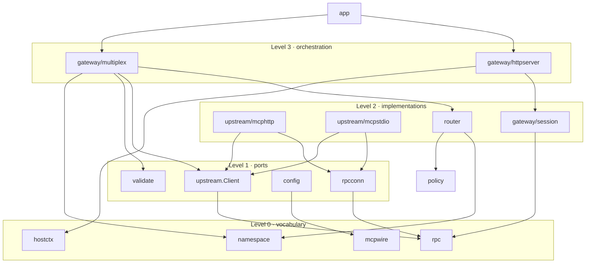
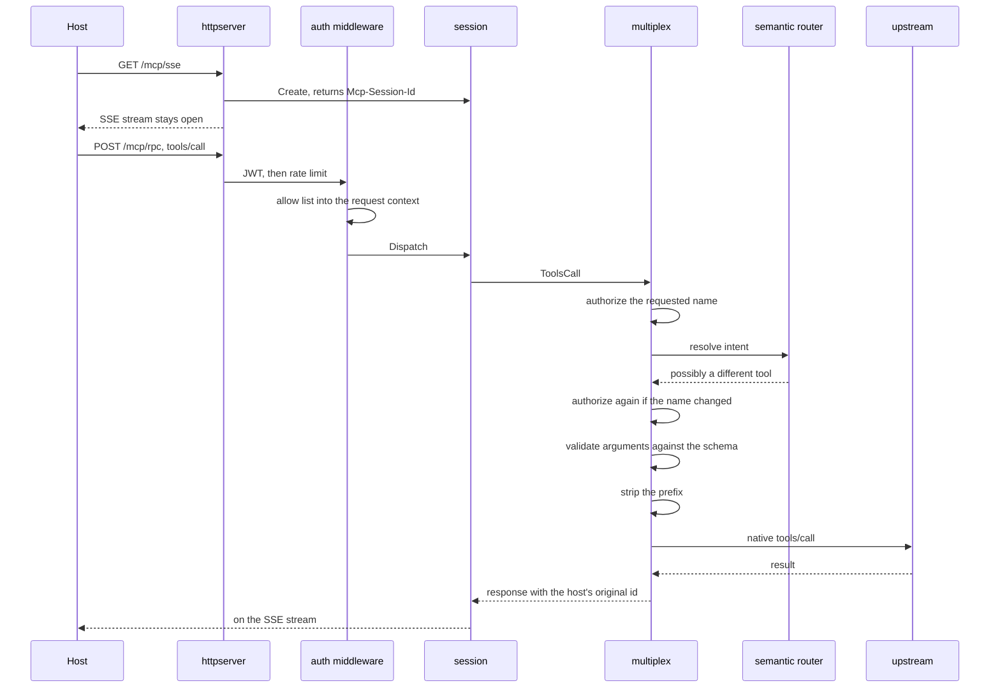

# Package layers and the life of a `tools/call`

Two things a reader needs before opening any file: what depends on what, and what happens to one
request. Both are generated from the code rather than drawn from memory, and both are checked
against it.

## The dependency graph is a strict DAG

Forty packages under `internal/` and `cmd/`, arranged in seven levels by longest path to a leaf.
**No package imports one at its own level or above.** That is not a style claim: it is what
`go list` reports today.

| Level | Packages | What they are |
|---|---|---|
| 0 | `rpc`, `mcpwire`, `errcodes`, `namespace`, `hostctx`, `defaults`, `policy`, `router/bm25`, `router/index`, `router/mode`, `upstream/framing` | Vocabulary. Wire shapes, protocol strings, error codes, tunables. Zero internal imports. |
| 1 | `config`, `telemetry`, `validate`, `rpcconn`, `upstream`, `router/embed`, `router/rules`, `router/store` | Ports and mechanisms. The `upstream.Client` port lives here; so do the router's storage and embedding interfaces. |
| 2 | `auth`, `auth/ratelimit`, `gateway/session`, `router`, `upstream/mcphttp`, `upstream/mcpstdio`, `upstream/mock` | Implementations. Two real transports and one mock behind the same port; the semantic router behind its own. |
| 3 | `gateway/httpserver`, `gateway/multiplex`, `mcpupstreammock`, `routertest` | Orchestration. The multiplexer fans out; the HTTP server owns sessions and transport. |
| 4 | `gateway/orchestrator`, `cmd/mock_upstream`, `cmd/smoke_upstream`, `cmd/gen-router-eval-catalog` | Wiring: middleware order, OTel handler. The commands that drive a mock sit here because they import it. |
| 5 | `app` | Composition root. Twenty internal imports, and the only package allowed that many. |
| 6 | `cmd/gateway` | `main`, deliberately thin. |

The other commands sit lower, at the level of what they import: `cmd/gen-jwt` at 1, `cmd/loadtest`
and `cmd/mcp_host_demo` at 2, since a host client needs no more than the wire vocabulary.

The rule in one sentence: **dependencies point down, and the level of a package is the level of its
deepest import plus one.**

## The life of a `tools/call`

The order below is the order in the code, including the part that is easy to get wrong.

**Why authorization appears twice.** The semantic router may answer a request for one tool with a
different one. Authorizing only before routing would let the router hand back a tool the caller is
not allowed to use; authorizing only after would run the router on behalf of a caller allowed
nothing. So the gateway checks the requested name first, and checks again whenever routing changed
it. The second check is skipped only when the name did not change.

**Why the response carries the host's id.** Golden rule R3: the id the host sent is the id it gets
back, including when the value comes from an upstream that echoed a differently formatted one. The
correlator in `rpcconn` canonicalises the upstream's spelling and the multiplexer restores the
host's.

## References

- [ADR 0005](../adr/0005-tool-namespacing-and-opaque-ids.md), the `__` separator and prefix stripping
- [ADR 0004](../adr/0004-gateway-scope.md), which methods aggregate and which forward
- [internal/gateway/multiplex/tools_call.go](../../internal/gateway/multiplex/tools_call.go), the sequence above
